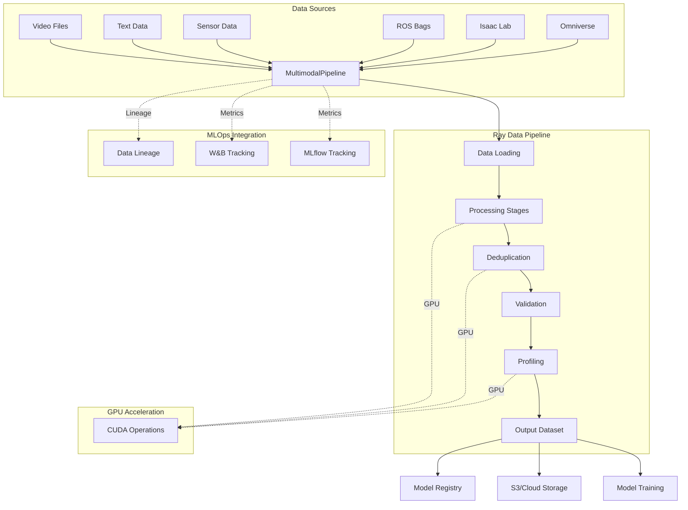

# Multimodal Data Curation Pipeline for Robotics Foundation Models

A production-ready GPU-accelerated data curation pipeline built on Ray for processing multimodal datasets (video, text, sensor data) used in robotics foundation model training. Optimized for GR00T and other NVIDIA robotics foundation models with support for internet-scale data processing, high-throughput simulation, and teleoperation data collection.

## Quick Start

```bash
pip install -e ".[dev]"
```

```python
from pipeline.api import pipeline

p = pipeline(
    sources="s3://bucket/data/",
    output="s3://bucket/output/",
    num_gpus=4
)
results = p.run()
```

See the [Quick Start Guide](docs/guides/QUICKSTART.md) for more examples.

## Overview

This project demonstrates large-scale distributed data ETL and management systems optimized for multimodal foundation models. It addresses the core challenges in robotics data infrastructure:

- **Scalable Processing**: Distributed data processing using Ray Data and Ray Core
- **GPU Acceleration**: CUDA-accelerated deduplication and embedding generation
- **Multimodal Support**: Unified pipeline for video, text, and sensor data
- **Streaming Architecture**: Efficient data flow with minimal I/O overhead
- **Observability**: Built-in monitoring and performance metrics
- **Production Ready**: Comprehensive testing, CI/CD, and documentation
- **GR00T Optimized**: Explicit support for data fuel hierarchy, domain randomization, and high-throughput simulation

## Key Features

- **GPU-Accelerated Deduplication**: Fuzzy LSH, semantic, and exact deduplication on GPU
- **Multimodal Data Processing**: Video, text, sensor, ROS bags, and simulation data
- **Streaming Pipeline Architecture**: Process datasets larger than memory with checkpointing
- **DataFrame API**: Pythonic API inspired by Pandas, Spark, and Polars
- **Robotics-Specific**: Native ROS support, Isaac Lab integration, domain randomization
- **MLOps Integration**: MLflow and W&B experiment tracking, model registry
- **Production Ready**: Kubernetes deployment, Prometheus metrics, Grafana dashboards

See [Features](docs/features.md) for detailed feature documentation.

## Architecture



See [Architecture Overview](docs/architecture/OVERVIEW.md) for detailed architecture documentation.

## Documentation

### Getting Started
- [Quick Start Guide](docs/guides/QUICKSTART.md) - Getting started tutorial
- [API Reference](docs/api/README.md) - Complete API documentation

### Core Documentation
- [Business Value](docs/business-value.md) - Why use this pipeline
- [Features](docs/features.md) - Detailed feature documentation
- [Architecture](docs/architecture/OVERVIEW.md) - System architecture details
- [GPU Optimizations](docs/performance/gpu-optimizations.md) - GPU acceleration guide

### Integrations
- [Datasources](docs/integrations/datasources.md) - Supported data formats
- [Integration Examples](docs/integrations/examples.md) - Isaac Lab, Omniverse, GR00T

### Production
- [Deployment Guide](docs/deployment/README.md) - Production deployment
- [Production Best Practices](docs/deployment/PRODUCTION.md) - Production operations
- [Extensibility](docs/architecture/EXTENSIBILITY.md) - Extending the pipeline

## Requirements

- **Python**: 3.9+
- **Ray**: 2.8.0+
- **CUDA**: 11.8+ (optional, for GPU features)
- **Storage**: S3-compatible or local filesystem

## Development

```bash
# Install development dependencies
pip install -e ".[dev]"

# Run tests
pytest

# Run linting
ruff check pipeline/
mypy pipeline/

# Run examples
python examples/basic_declarative_api.py
```

## Contributing

See [CONTRIBUTING.md](CONTRIBUTING.md) for guidelines.

## License

MIT License - see [LICENSE](LICENSE) file.
