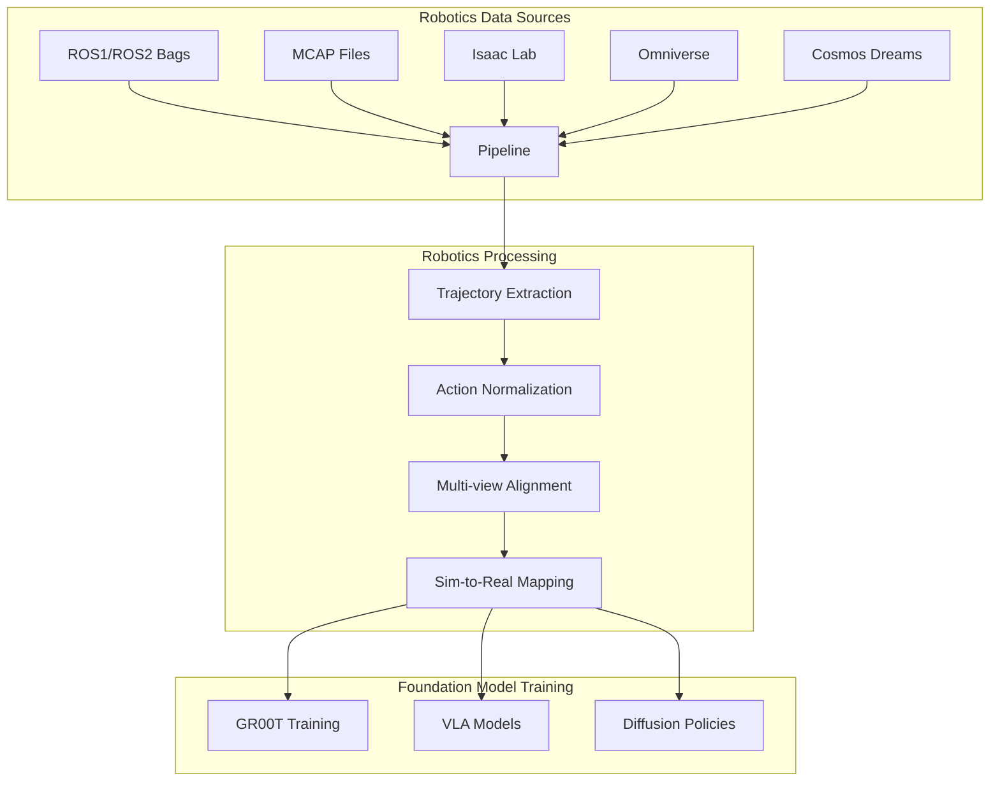
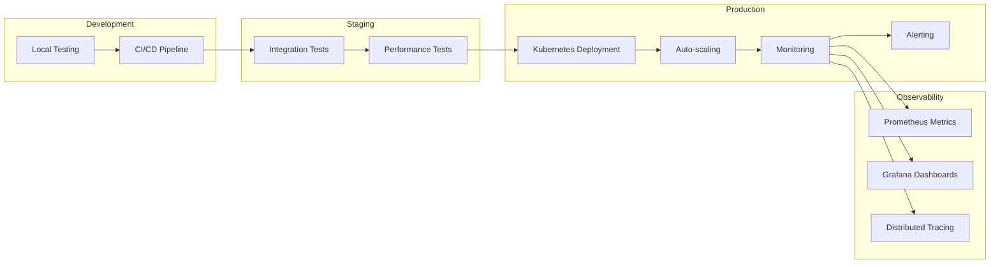
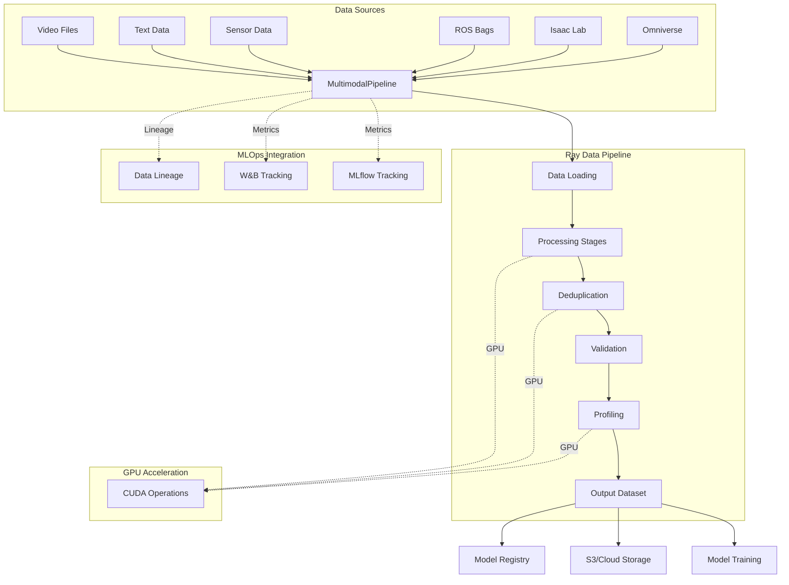
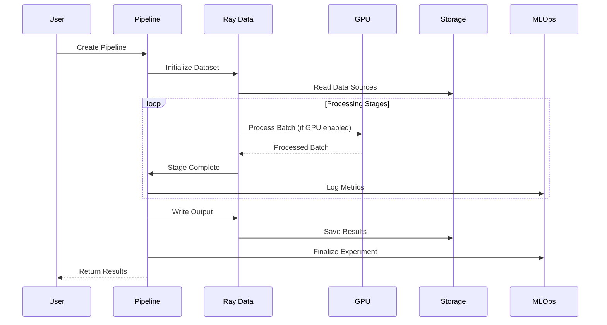
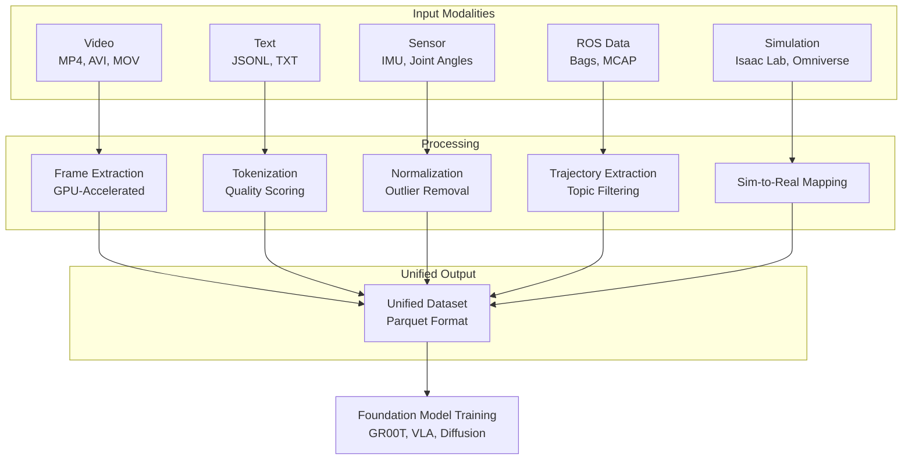
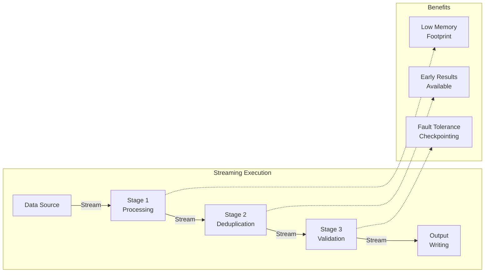
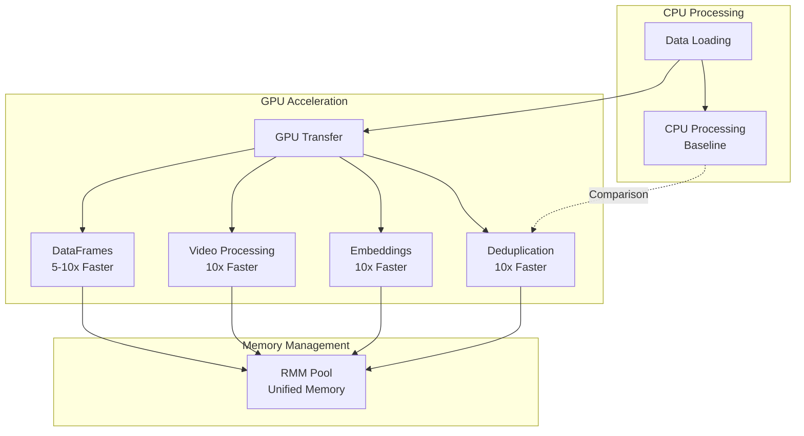
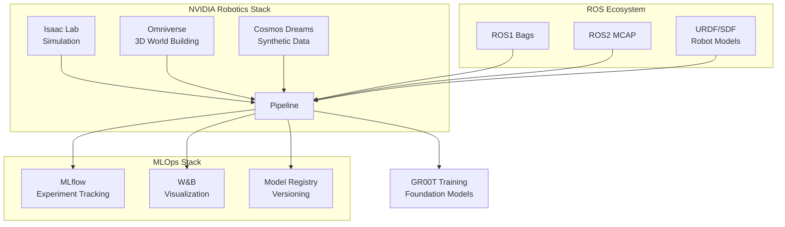
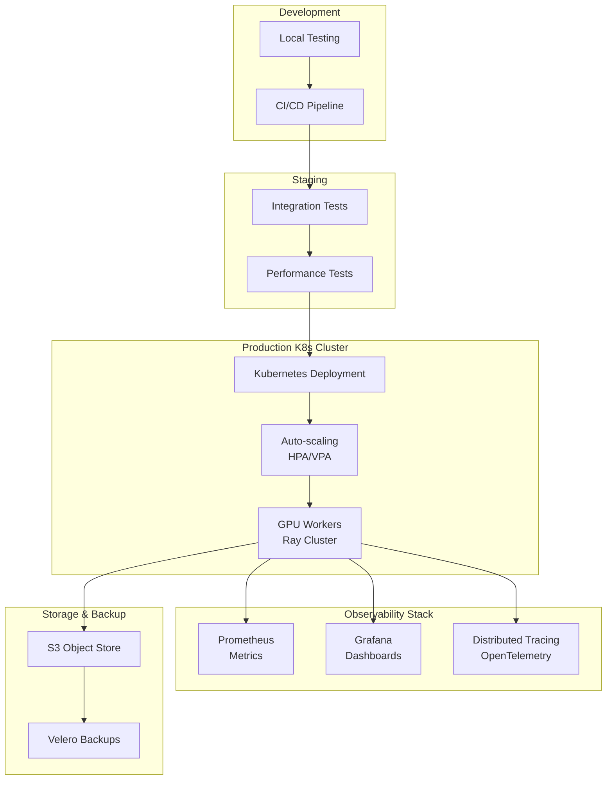
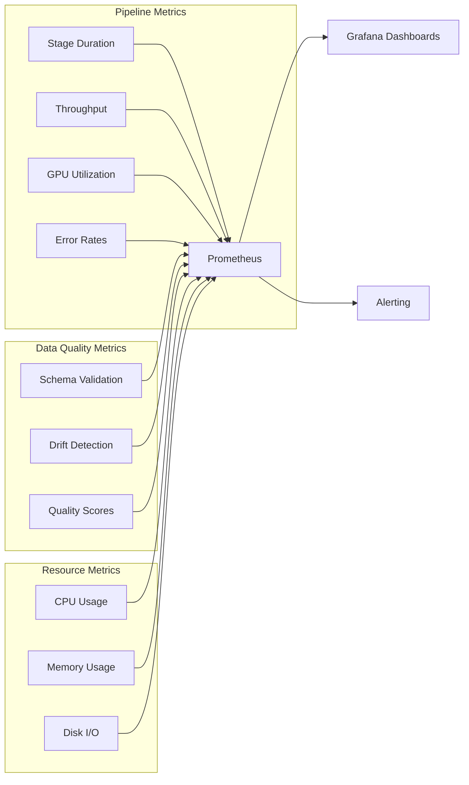

# Multimodal Data Curation Pipeline for Robotics Foundation Models

A production-ready GPU-accelerated data curation pipeline built on Ray for processing multimodal datasets (video, text, sensor data) used in robotics foundation model training. Optimized for GR00T and other NVIDIA robotics foundation models with support for internet-scale data processing, high-throughput simulation, and teleoperation data collection.

## Overview

This project demonstrates large-scale distributed data ETL and management systems optimized for multimodal foundation models. It addresses the core challenges in robotics data infrastructure:

- **Scalable Processing**: Distributed data processing using Ray Data and Ray Core
- **GPU Acceleration**: CUDA-accelerated deduplication and embedding generation
- **Multimodal Support**: Unified pipeline for video, text, and sensor data
- **Streaming Architecture**: Efficient data flow with minimal I/O overhead
- **Observability**: Built-in monitoring and performance metrics
- **Production Ready**: Comprehensive testing, CI/CD, and documentation
- **GR00T Optimized**: Explicit support for data fuel hierarchy, domain randomization, and high-throughput simulation

## Business Value

### Why This Pipeline?

#### **Higher-Level API Than Ray Data**
While Ray Data provides powerful distributed processing primitives, this pipeline adds a **robotics-focused abstraction layer** that simplifies common workflows:

```python
# Ray Data (lower-level)
dataset = ray.data.read_parquet("s3://bucket/data/")
dataset = dataset.map_batches(process_fn, batch_size=100)
dataset = dataset.filter(lambda x: x["quality"] > 0.8)
dataset.write_parquet("s3://bucket/output/")

# This Pipeline (higher-level, robotics-focused)
p = pipeline(
    sources="s3://bucket/data/",
    output="s3://bucket/output/",
    num_gpus=4
)
results = p.run()  # Automatic deduplication, validation, quality checks
```

**Benefits:**
- **Domain-Specific**: Built-in support for robotics data formats (MCAP, ROS bags, URDF)
- **MLOps Integration**: Automatic experiment tracking, model registry, and data lineage
- **Quality Assurance**: Built-in profiling, validation, and drift detection
- **GPU Optimization**: Automatic GPU memory management and CUDA acceleration

#### **Robotics-Specific Features**
Designed specifically for robotics foundation model training with native support for:



- **Native ROS Support**: Direct integration with ROS1/ROS2 bag files and MCAP format
- **Simulation Integration**: Seamless data loading from Isaac Lab and Omniverse
- **Trajectory Processing**: Built-in support for robot trajectories, actions, and observations
- **Multi-modal Alignment**: Automatic synchronization of video, sensor, and control data
- **Sim-to-Real**: Tools for bridging simulation and real-world robotics data
- **Domain Randomization**: Automatic parameter randomization for robust sim-to-real transfer
- **Teleoperation Processing**: VR-based teleoperation data processing with multi-view synchronization
- **High-Throughput Simulation**: Support for 10,000+ parallel environments with GPU acceleration
- **Data Hierarchy**: Explicit support for internet-scale data, synthetic simulation data, and teleoperation data

#### **GR00T Data Hierarchy**
Explicit support for NVIDIA's data pyramid strategy:

```python
# Internet-scale data: Web data and human videos
internet_scale_sources = [
    "s3://bucket/internet_videos/",  # 100M+ video clips
    "s3://bucket/text_corpus/",      # Web-scale text data
]

# Synthetic data: Simulation data from Simulation 1.0 and 2.0
synthetic_sources = [
    isaac_lab_loader,  # Simulation 1.0: Digital twins
    cosmos_dreams_loader,  # Simulation 2.0: Neurophysics engines
]

# Teleoperation data: Real robot teleoperation data
teleoperation_sources = [
    "s3://bucket/teleop_data/",  # 4-24 hours per robot per day
]
```

**Features:**
- **Internet-Scale Data Processing**: Internet-scale data deduplication and quality filtering
- **Synthetic Data Generation**: High-throughput synthetic data generation (10,000x faster than real-time)
- **Teleoperation Data Collection**: Teleoperation data processing with VR support and multi-view synchronization
- **Unified Pipeline**: Seamlessly combines all three data types into training-ready datasets

#### **Repeatability & Reproducibility**
Ensure consistent, reproducible data processing across teams and environments:

```yaml
# pipeline_config.yaml - Version controlled, reproducible
sources:
  - type: video
    path: s3://bucket/videos/
output: s3://bucket/curated/
num_gpus: 4
batch_size: 1024
```

**Features:**
- **Declarative Configuration**: YAML-based pipelines that are version-controlled and shareable
- **Deterministic Processing**: Reproducible results with seed support and deterministic algorithms
- **Experiment Tracking**: Full lineage tracking with MLflow/W&B integration
- **Checkpointing**: Resume from failures with automatic checkpoint management
- **Environment Isolation**: Docker and Kubernetes support for consistent execution

#### **Extensibility & Customization**
Easily extend the pipeline with custom stages, datasources, and integrations:

```python
# Custom processing stage
class CustomRoboticsStage(PipelineStage):
    def process(self, dataset):
        return dataset.map_batches(self._process_robotics_batch)
    
    def _process_robotics_batch(self, batch):
        # Your custom robotics processing logic
        return transform_robotics_data(batch)

# Use in pipeline
p = (
    PipelineBuilder()
    .source("mcap", "s3://bucket/rosbags/")
    .stage(CustomRoboticsStage())
    .output("s3://bucket/output/")
    .build()
)
```

**Extensibility Points:**
- **Custom Stages**: Add any processing logic as a pipeline stage
- **Custom Datasources**: Support for any data format with plugin system
- **Custom Validators**: Domain-specific validation rules
- **Custom Metrics**: Add custom observability metrics
- **Plugin Architecture**: Modular design for easy extension

#### **Production-Ready Operations**
Built for production deployments with enterprise-grade features:



- **Kubernetes Native**: Full support for K8s deployment with Helm charts
- **Auto-scaling**: Automatic resource scaling based on workload
- **Monitoring**: Prometheus metrics, Grafana dashboards, distributed tracing
- **Error Handling**: Robust error handling with retry mechanisms and graceful degradation
- **Security**: Support for secrets management, network policies, and RBAC

#### **Cost Efficiency**
Optimize compute costs with intelligent resource management:

- **GPU Utilization**: Maximize GPU usage with automatic batch sizing and memory management
- **Streaming Execution**: Process data incrementally to reduce memory footprint
- **Smart Caching**: Intelligent caching to avoid redundant computation
- **Resource Tuning**: Automatic per-stage resource allocation based on historical metrics
- **Spot Instance Support**: Designed to work with spot instances for cost savings

## Architecture

### System Overview



### Pipeline Execution Flow



### API Layers

```mermaid
graph TB
    subgraph "User-Facing APIs"
        A[Simple Function API<br/>pipeline()]
        B[Fluent Builder API<br/>PipelineBuilder]
        C[DataFrame API<br/>read()]
        D[YAML Config<br/>load_from_yaml()]
    end
    
    subgraph "Core Pipeline"
        E[MultimodalPipeline]
        F[PipelineExecutor]
        G[Stage Orchestrator]
    end
    
    subgraph "Ray Data Layer"
        H[Ray Dataset]
        I[Map Batches]
        J[GPU Object Store]
    end
    
    A --> E
    B --> E
    C --> E
    D --> E
    
    E --> F
    F --> G
    G --> H
    H --> I
    I --> J
```

## Quick Start

### Installation

```bash
# Install with development dependencies
pip install -e ".[dev]"

# Or install minimal dependencies
pip install -e .
```

### Basic Usage

#### Python API

**Simple Function API:**

```python
from pipeline.api import pipeline

# Simple function API - easiest way to create a pipeline
p = pipeline(
    sources="s3://bucket/data/",
    output="s3://bucket/output/",
    num_gpus=4
)

# Run pipeline
results = p.run()
print(f"Processed {results['total_items']} items")
```

**Fluent Builder API:**

```python
from pipeline.api import PipelineBuilder

# Method chaining with short, intuitive names
p = (
    PipelineBuilder()
    .source("video", "s3://bucket/videos/")
    .source("text", "s3://bucket/text/")
    .gpu(num_gpus=4)
    .batch(32)
    .profile(profile_columns=["image", "text"])
    .validate(expected_schema={"image": list, "text": str})
    .output("s3://bucket/output/")
    .build()
)

results = p.run()
```

**DataFrame API (Pythonic):**

```python
from pipeline.api import read

# Read data into DataFrame
df = read("s3://bucket/data/")

# Use standard Python built-ins
print(f"Rows: {len(df)}")  # len() support
print(f"Shape: {df.shape}")  # (rows, columns)
print(f"Columns: {df.columns}")  # Column names

# Pythonic indexing and slicing
first_10 = df[0:10]  # Slicing (like Pandas)
column = df["episode_id"]  # Column access
value = df.episode_id  # Attribute-style access

# Operator overloading
df1 = read("s3://bucket/data1/")
df2 = read("s3://bucket/data2/")
combined = df1 + df2  # Concatenate (like pd.concat)

# Pandas-style methods
df.drop("unused_col")  # Drop columns
df.to_parquet("output.parquet")  # Write to Parquet
df.assign(status="active")  # Add columns

# Lazy transformations with method chaining
result = (
    df
    .filter(lambda x: x["quality"] > 0.8)
    .map(lambda x: {**x, "processed": True})
    .groupby("episode_id")
    .agg({"sensor_data": "mean"})
    .collect()  # Trigger execution
)
```

**Legacy API (Still Supported):**

```python
from pipeline import MultimodalPipeline, PipelineConfig

# Create pipeline configuration
config = PipelineConfig(
    batch_size=32,
    output_path="s3://bucket/output/",
    enable_gpu=True
)

# Initialize pipeline
pipeline = MultimodalPipeline(config)

# Add data sources
pipeline.add_video_data("s3://bucket/videos/*.mp4")
pipeline.add_text_data("s3://bucket/text/*.jsonl")

# Run pipeline
result = pipeline.run()
print(f"Processed {result['total_items']} items")
```

#### YAML Configuration

```yaml
# pipeline_config.yaml
sources:
  - type: video
    path: s3://bucket/videos/
    extract_frames: true
    frame_rate: 30
  
  - type: text
    path: s3://bucket/text/
    min_length: 10
    max_length: 512

output: s3://bucket/output/
num_gpus: 4
batch_size: 1024
```

```python
from pipeline.api import load_from_yaml

# Load and run from YAML
pipeline = load_from_yaml("pipeline_config.yaml")
results = pipeline.run()
```

## Key Features

### 1. GPU-Accelerated Deduplication

| Method | Description | Use Case |
|--------|-------------|----------|
| **Fuzzy LSH** | Locality-sensitive hashing on GPU | Fast approximate deduplication |
| **Semantic** | Embedding-based clustering | Content similarity detection |
| **Exact** | Hash-based exact matching | Perfect duplicate removal |

```python
from pipeline.dedup import FuzzyDeduplicator

deduplicator = FuzzyDeduplicator(
    threshold=0.9,
    num_permutations=128,
    use_gpu=True
)

dataset = deduplicator.deduplicate(dataset)
```

### 2. Multimodal Data Processing



**Supported Data Types:**

- **Video**: Frame extraction, temporal segmentation, quality filtering
- **Text**: Tokenization, quality scoring, language detection
- **Sensor**: IMU data, joint angles, control signals
- **Simulation**: Isaac Lab trajectories (10,000+ parallel environments), Cosmos Dreams outputs
- **Teleoperation**: VR-based teleoperation data with multi-view camera synchronization
- **Domain Randomization**: Automatic parameter randomization for sim-to-real transfer

### 3. Streaming Pipeline Architecture



**Key Advantages:**
- **Low Memory Footprint**: Process data incrementally without loading entire dataset
- **Early Results**: Start consuming output while pipeline is still running
- **Fault Tolerance**: Automatic checkpointing enables resume from failures
- **Scalability**: Handle datasets larger than available memory
- **Trillions of Tokens**: Designed to process internet-scale datasets (100M+ video clips, billions of tokens)
- **High-Throughput Simulation**: Support for 10,000+ parallel Isaac Lab environments (10,000x faster than real-time)

```python
from pipeline import MultimodalPipeline
from pipeline.stages import VideoProcessor, TextProcessor

# Create pipeline with custom stages
pipeline = MultimodalPipeline(config)

# Add processing stages
pipeline.add_stage(VideoProcessor(
    extract_frames=True,
    frame_rate=30,
    resolution=(224, 224)
))

pipeline.add_stage(TextProcessor(
    min_length=10,
    remove_boilerplate=True
))

# Process with streaming execution
result = pipeline.run()
```
## Key Features

### DataFrame-Like API (Inspired by Spark, Polars, Pandas)

```mermaid
graph TB
    subgraph "DataFrame API"
        A[read<br/>Load Data] --> B[Transform<br/>filter, map, groupby]
        B --> C[Aggregate<br/>agg, join, sort]
        C --> D[Write<br/>to_parquet, to_json]
    end
    
    subgraph "Pythonic Features"
        E[len<br/>Shape<br/>Columns]
        F[Indexing<br/>Slicing<br/>Attribute Access]
        G[Operators<br/>+, |, ==]
    end
    
    A --> E
    B --> F
    C --> G
```

**Benefits:**

- **PipelineDataFrame**: Fluent DataFrame API with lazy evaluation
- **Method Chaining**: Intuitive method chaining for pipeline construction
- **GPU Acceleration**: Seamless GPU acceleration for batch operations
- **Lazy Evaluation**: Transformations are lazy until actions are called
- **Comprehensive Operations**: Filter, map, groupby, join, sort, sample, and more

### Batch Inference with MLOps Integration

- **Batch Inference**: Distributed batch inference using Ray Data with GPU acceleration
- **Model Registry**: Integration with MLflow Model Registry for model versioning
- **Prediction Logging**: Automatic logging of predictions to MLflow/W&B for monitoring
- **Model Staging**: Support for model stages (Staging, Production, Archived)
- **TensorRT Support**: Optional NVIDIA TensorRT optimization for inference
- **DALI Integration**: Optional NVIDIA DALI for GPU-accelerated data loading

### Enhanced Data Quality Checks

- **Schema Validation**: Validate data schemas and detect schema drift
- **Data Profiling**: Comprehensive data profiling with statistics and outlier detection (GPU-accelerated with cuDF)
- **Drift Detection**: Detect data drift using KS test, PSI, or chi-square methods
- **Missing Value Detection**: Identify and report missing values

### Feature Engineering and ETL

- **Feature Engineering**: Extract and transform features from raw data
- **Data Transformation**: Flexible data transformation with filtering
- **Data Aggregation**: Groupby and aggregation operations (GPU-accelerated)
- **Feature Store Integration**: Integration with Feast and other feature stores

### Experiment Tracking

- **MLflow Integration**: Full MLflow experiment tracking support
- **Weights & Biases Integration**: Full W&B experiment tracking support
- **Dual Tracking**: Support for both MLflow and W&B simultaneously
- **Automatic Logging**: Automatic parameter and metric logging

### GR00T-Specific Features

**Domain Randomization:**
- Visual randomization (lighting, textures, backgrounds)
- Physical randomization (friction, mass, damping, gravity)
- Geometric randomization (object sizes, positions, orientations)
- Sensor randomization (camera noise, calibration errors)
- Dynamics randomization (actuator delays, joint limits, compliance)
- Supports 10,000+ randomized environments for robust sim-to-real transfer

**Teleoperation Processing:**
- VR-based teleoperation support (Apple Vision Pro, etc.)
- Multi-view camera synchronization (2-4 camera views)
- Real-time data streaming at 10-30 Hz control frequency
- Action retargeting (human to robot kinematics)
- Temporal alignment and trajectory segmentation
- Handles 4-24 hours of teleoperation data per robot per day

**High-Throughput Simulation:**
- Parallel environment support (10,000+ environments on GPU)
- GPU-accelerated PhysX physics simulation
- 10,000x faster than real-time simulation speed
- Efficient vectorized operations for massive parallel execution

## Datasource Integrations

The pipeline supports a wide range of datasources for robotics and multimodal data:

### Supported Datasources

| Datasource | Format | Description | GPU Support |
|------------|--------|-------------|-------------|
| **Video** | MP4, AVI, MOV | Frame extraction, temporal segmentation | CUDA |
| **Text** | JSONL, TXT | Tokenization, quality filtering | Embeddings |
| **Parquet** | Parquet | Structured tabular data | cuDF |
| **MCAP** | MCAP | ROS2 robotics data format | CPU only |
| **HDF5** | HDF5 | Scientific datasets | CPU only |
| **Point Cloud** | PCD, PLY | 3D point cloud data | cuPy |
| **ROS Bag** | .bag | ROS1 bag files | CPU only |
| **ROS2 Bag** | .db3 | ROS2 bag files | CPU only |
| **Velodyne** | PCAP, VLP | LIDAR sensor data | cuPy |
| **Protobuf** | .pb, .bin | Protocol buffer messages | CPU only |
| **MessagePack** | .msgpack | Compact binary format | CPU only |
| **Binary** | Custom | Raw binary with struct parsing | CPU only |
| **Archive** | ZIP, TAR | Compressed archives | CPU only |
| **YAML** | YAML | Configuration files | CPU only |
| **URDF/SDF** | XML | Robot description files | CPU only |
| **Calibration** | YAML, JSON | Camera/sensor calibration | CPU only |

### Using Datasources

```python
from pipeline.api import Pipeline

# Multiple datasource types
pipeline = Pipeline(
    sources=[
        # Video files
        {
            "type": "video",
            "path": "s3://bucket/videos/*.mp4",
            "extract_frames": True,
            "frame_rate": 30,
            "resolution": (224, 224)
        },
        # MCAP (ROS2) files
        {
            "type": "mcap",
            "path": "s3://bucket/ros2_bags/*.mcap",
            "topics": ["/camera/image", "/lidar/points"],
            "time_range": (0, 3600)  # First hour
        },
        # Point cloud data
        {
            "type": "pointcloud",
            "path": "s3://bucket/lidar/*.pcd",
            "max_points": 100000,
            "downsample_large": True
        },
        # HDF5 datasets
        {
            "type": "hdf5",
            "path": "s3://bucket/sensor_data/*.h5",
            "datasets": ["imu_data", "joint_angles"],
            "max_datasets": 10
        },
        # ROS1 bag files
        {
            "type": "rosbag",
            "path": "s3://bucket/ros_bags/*.bag",
            "topics": ["/camera/image_raw", "/odom"],
            "max_messages": 10000
        }
    ],
    output="s3://bucket/curated/",
    enable_gpu=True
)
```

### Custom Datasources

```python
from pipeline.datasources.base import FileBasedDatasource
from ray.data.block import Block, ArrowBlockBuilder

class CustomDatasource(FileBasedDatasource):
    def _read_stream(self, f, path: str):
        # Read and process file
        data = f.readall()
        builder = ArrowBlockBuilder()
        builder.add({"data": process_data(data)})
        yield builder.build()
```

## GPU Optimizations

The pipeline leverages NVIDIA GPU acceleration for maximum performance:



### GPU-Accelerated Features

| Feature | Technology | Speedup | Description |
|---------|------------|---------|-------------|
| **Deduplication** | CUDA LSH | 10x | Locality-sensitive hashing on GPU |
| **Embeddings** | cuPy + cuDF | 10x | GPU-accelerated embedding generation |
| **Video Processing** | CUDA + cuPy | 10x | Frame extraction and processing |
| **Array Operations** | cuPy | 5-10x | NumPy-compatible GPU arrays |
| **DataFrames** | cuDF | 5-10x | Pandas-compatible GPU DataFrames |
| **Memory Management** | RMM | - | Unified GPU memory pool |

### CUDA Optimizations

```python
from pipeline import Pipeline

# Enable GPU acceleration
pipeline = Pipeline(
    sources=[...],
    output="s3://bucket/output/",
    enable_gpu=True,
    num_gpus=4,  # Use 4 GPUs
    gpu_memory_fraction=0.8,  # Use 80% of GPU memory
    use_mixed_precision=True,  # FP16 for faster processing
    enable_cuda_graphs=True,  # CUDA graphs for performance
)
```

### GPU Memory Management

```python
from pipeline.utils.gpu.memory import (
    get_gpu_memory_info,
    check_gpu_memory,
    gpu_memory_cleanup
)

# Check GPU memory
memory_info = get_gpu_memory_info()
print(f"GPU Memory: {memory_info['used']} / {memory_info['total']} GB")

# Cleanup GPU cache
gpu_memory_cleanup()
```

### RAPIDS Integration

```python
from pipeline.utils.gpu.rapids import (
    initialize_rapids_environment,
    initialize_rmm_pool,
    optimize_cudf_settings
)

# Initialize RAPIDS for GPU-accelerated dataframes
initialize_rapids_environment()
initialize_rmm_pool(pool_size="8GB")
optimize_cudf_settings()

# Use cuDF for GPU-accelerated operations
import cudf
df = cudf.read_parquet("s3://bucket/data.parquet")
result = df.groupby("category").mean()  # Runs on GPU
```

### Performance Tuning

```python
# GPU-optimized pipeline configuration for GR00T-scale workloads
config = PipelineConfig(
    batch_size=1024,  # Larger batches for GPU
    num_gpus=256,  # Scale to internet-scale datasets
    gpu_batch_size=2048,  # GPU-specific batch size
    prefetch_batches=4,  # Overlap CPU/GPU work
    streaming=True,  # Streaming for better GPU utilization
    enable_object_spilling=False,  # Keep data on GPU
    target_max_block_size=512 * 1024 * 1024,  # 512MB blocks
    enable_domain_randomization=True,  # For sim-to-real transfer
    num_randomized_environments=10000,  # High-throughput simulation
)
```

**Performance Characteristics:**
- **Simulation Speedup**: 10,000x faster than real-time with GPU acceleration
- **Parallel Environments**: 10,000+ environments per GPU
- **Throughput**: 10,000+ environment steps per second on single GPU
- **Scalability**: Linear scaling with GPU count
- **Memory Efficiency**: Shared GPU memory for common assets, efficient state caching

### GPU Deduplication

```python
from pipeline.dedup import FuzzyDeduplicator, SemanticDeduplicator

# GPU-accelerated fuzzy deduplication
fuzzy_dedup = FuzzyDeduplicator(
    threshold=0.9,
    num_permutations=128,
    use_gpu=True,  # Enable GPU acceleration
    num_gpus=4
)

# GPU-accelerated semantic deduplication
semantic_dedup = SemanticDeduplicator(
    model_name="sentence-transformers/all-MiniLM-L6-v2",
    use_gpu=True,
    batch_size=1024  # Larger batches for GPU
)

dataset = fuzzy_dedup.deduplicate(dataset)
dataset = semantic_dedup.deduplicate(dataset)
```

## Integration Examples

### Robotics Ecosystem Integration



### Isaac Lab Integration

```python
from pipeline.integrations.isaac_lab import IsaacLabLoader

loader = IsaacLabLoader(
    robot_type="isaac.manipulation.handover",
    include_metadata=True,
    include_observations=True,
    include_actions=True,
    enable_domain_randomization=True,
    num_parallel_environments=4096,
    use_gpu=True,
)

pipeline.add_simulation_data(loader)
```

**High-Throughput Simulation:**
- Supports 10,000+ parallel environments on GPU
- GPU-accelerated PhysX physics simulation
- 10,000x faster than real-time simulation speed
- Domain randomization for robust sim-to-real transfer

### Cosmos Dreams Integration

```python
from pipeline.integrations.cosmos import CosmosDreamsLoader

loader = CosmosDreamsLoader(
    dreams_path="s3://bucket/cosmos_dreams/",
    model_name="groot-dreams-v1",
    include_metadata=True
)

pipeline.add_synthetic_data(loader)
```

### GR00T Model Training

```python
from pipeline.training.integration import TrainingPipelineIntegration
from pipeline.utils.domain_randomization import DomainRandomizer
from pipeline.utils.teleoperation import TeleoperationProcessor

# Prepare curated dataset for training
training_integration = TrainingPipelineIntegration(
    output_format="parquet",
    batch_size=256,
    shuffle=True
)

# Split into train/val and write to disk
training_data = training_integration.prepare_for_training(
    dataset=curated_dataset,
    output_path="s3://bucket/groot_training_data/",
    train_split=0.9
)

# Create PyTorch DataLoader for training
train_loader = training_integration.create_dataloader(
    dataset_path=training_data["train_path"],
    num_workers=4,
    pin_memory=True
)
```

**GR00T-Specific Training Features:**
- **Data Hierarchy**: Explicit support for internet-scale data, synthetic simulation data, and teleoperation data
- **Domain Randomization**: Automatic parameter randomization for sim-to-real transfer
- **Teleoperation Processing**: VR-based teleoperation data with multi-view synchronization
- **High-Throughput Simulation**: 10,000+ parallel environments (10,000x faster than real-time)
- **Trillions of Tokens**: Designed to process internet-scale datasets efficiently

See [`examples/groot_model_training.py`](examples/groot_model_training.py) for complete training example.

See [`examples/mlops_batch_inference.py`](examples/mlops_batch_inference.py) for complete batch inference example.

## Project Structure

```
nvidia-demo/
├── pipeline/              # Main Python package
│   ├── api/              # Public API
│   ├── core/             # Core orchestration
│   ├── datasources/      # Data source implementations
│   ├── stages/           # Processing stages
│   └── training/         # Training integration
├── examples/             # Example scripts
├── docs/                 # Documentation
└── tests/                # Test suite
```

## Production Requirements

### Production Architecture



### Observability & Monitoring

The pipeline includes comprehensive observability features for production deployments:

#### Metrics & Monitoring

```python
from pipeline.observability.metrics import PipelineMetrics

# Initialize metrics collection
metrics = PipelineMetrics(
    enable_prometheus=True,
    prometheus_port=9090,
    enable_grafana=True
)

# Track custom metrics
metrics.record_stage_duration("deduplication", duration_seconds=10.5)
metrics.record_items_processed("video", count=1000)
metrics.record_gpu_utilization(gpu_id=0, utilization=0.85)
```

**Available Metrics:**



| Metric Type | Description | Export Format |
|-------------|-------------|---------------|
| **Stage Duration** | Processing time per stage | Prometheus histogram |
| **Items Processed** | Throughput per data type | Prometheus counter |
| **GPU Utilization** | GPU usage and memory | Prometheus gauge |
| **Error Rates** | Failure rates by stage | Prometheus counter |
| **Data Quality** | Quality scores and validation | Prometheus histogram |
| **Resource Usage** | CPU, memory, disk I/O | Prometheus gauge |

#### Grafana Dashboards

```python
from pipeline.visualization import generate_grafana_dashboard

# Generate Grafana dashboard configuration
dashboard_config = generate_grafana_dashboard(
    metrics_source="prometheus",
    include_gpu_metrics=True,
    include_stage_breakdown=True
)

# Export to JSON for Grafana import
with open("grafana_dashboard.json", "w") as f:
    json.dump(dashboard_config, f, indent=2)
```

**Dashboard Panels:**
- Pipeline throughput and latency
- GPU utilization and memory usage
- Stage-by-stage performance breakdown
- Error rates and failure analysis
- Data quality metrics
- Resource consumption trends

#### Health Checks

```python
from pipeline.health import HealthChecker

# Check overall system health
health = HealthChecker.get_overall_health(
    output_path="s3://bucket/output/",
    check_gpu=True,
    check_storage=True,
    check_ray_cluster=True
)

if not health['healthy']:
    print(f"Issues found: {health['issues']}")
```

**Health Check Endpoints:**
- `/health` - Basic health check
- `/health/ready` - Readiness probe (Kubernetes)
- `/health/live` - Liveness probe (Kubernetes)
- `/health/detailed` - Comprehensive health status

### Infrastructure Tooling

#### Kubernetes Operators

The pipeline integrates with standard Kubernetes operators for production infrastructure:

| Operator | Purpose | Configuration |
|----------|---------|---------------|
| **Prometheus Operator** | Metrics collection | `deployment/operators/prometheus-operator.yaml` |
| **Grafana Operator** | Dashboard management | `deployment/operators/grafana-operator.yaml` |
| **External Secrets** | Secret management | `deployment/operators/external-secrets-operator.yaml` |
| **Velero** | Backup & restore | `deployment/operators/velero-operator.yaml` |
| **VPA** | Auto-scaling | `deployment/operators/vpa-config.yaml` |
| **Fluent Bit** | Log aggregation | `deployment/operators/fluent-bit-operator.yaml` |

#### Deployment Configurations

```bash
# Deploy to Kubernetes
kubectl apply -f deployment/kubernetes-production.yaml

# Deploy with Helm
helm install pipeline ./deployment/helm

# Deploy with Kustomize
kubectl apply -k deployment/kustomize/production
```

**Production Features:**
- Horizontal Pod Autoscaling (HPA) for GPU workloads
- Vertical Pod Autoscaling (VPA) for resource optimization
- Network policies for security
- Resource quotas and limits
- Pod disruption budgets
- Service mesh integration (Istio/Linkerd)

#### CI/CD Integration

```yaml
# .github/workflows/ci.yml example
name: CI/CD Pipeline
on: [push, pull_request]
jobs:
  test:
    runs-on: [self-hosted, gpu]
    steps:
      - uses: actions/checkout@v3
      - name: Run tests
        run: pytest tests/
      - name: Run GPU tests
        run: pytest tests/ --gpu
      - name: Build Docker image
        run: docker build -t pipeline:latest .
```

### Extending the API

#### Custom Processing Stages

```python
from pipeline.stages.base import ProcessorBase
from ray.data import Dataset

class CustomProcessor(ProcessorBase):
    """Custom processing stage example."""
    
    def __init__(self, custom_param: str, batch_size: int = 100):
        super().__init__(batch_size=batch_size)
        self.custom_param = custom_param
    
    def process(self, dataset: Dataset) -> Dataset:
        """Process dataset through custom stage."""
        return dataset.map_batches(
            self._process_batch,
            batch_size=self.batch_size,
            batch_format="pandas"
        )
    
    def _process_batch(self, batch):
        # Your custom processing logic
        batch['processed'] = batch['data'].apply(self.custom_transform)
        return batch
    
    def custom_transform(self, data):
        return f"{self.custom_param}: {data}"

# Use in pipeline
pipeline = MultimodalPipeline(config)
pipeline.add_stage(CustomProcessor(custom_param="example"))
```

#### Custom Datasources

```python
from pipeline.datasources.base import FileBasedDatasource
from ray.data.block import Block, ArrowBlockBuilder
from typing import Iterator

class CustomDatasource(FileBasedDatasource):
    """Custom datasource for specialized data formats."""
    
    def _read_stream(self, f, path: str) -> Iterator[Block]:
        """Read and parse custom format."""
        self._validate_file_handle(f, path)
        
        # Read file content
        data = f.readall()
        
        # Parse custom format
        parsed_data = self._parse_custom_format(data)
        
        # Yield blocks
        builder = ArrowBlockBuilder()
        for item in parsed_data:
            builder.add({
                "field1": item["field1"],
                "field2": item["field2"],
            })
        yield builder.build()
    
    def _parse_custom_format(self, data: bytes):
        # Your parsing logic
        return [{"field1": "value1", "field2": "value2"}]

# Use in pipeline
from pipeline.api import Pipeline

pipeline = Pipeline(
    sources=[{
        "type": "custom",
        "path": "s3://bucket/custom_data/*.custom",
        "datasource_class": CustomDatasource
    }],
    output="s3://bucket/output/"
)
```

#### Custom Validators

```python
from pipeline.stages.base import ValidatorBase
from typing import Any, Dict

class CustomValidator(ValidatorBase):
    """Custom validation stage."""
    
    def __init__(self, validation_rule: str, reject_invalid: bool = False):
        super().__init__(reject_invalid=reject_invalid, batch_size=100)
        self.validation_rule = validation_rule
    
    def _validate_item(self, item: Dict[str, Any]) -> Dict[str, Any]:
        """Validate single item."""
        is_valid = self._check_rule(item)
        
        return {
            **item,
            "validation_result": "valid" if is_valid else "invalid",
            "validation_score": 1.0 if is_valid else 0.0
        }
    
    def _check_rule(self, item: Dict[str, Any]) -> bool:
        # Your validation logic
        return item.get("field") == self.validation_rule

# Use in pipeline
pipeline.add_stage(CustomValidator(validation_rule="expected_value"))
```

#### Plugin System

```python
from pipeline.core.factory import register_stage, register_datasource

# Register custom stage
@register_stage("custom_processor")
def create_custom_processor(**kwargs):
    return CustomProcessor(**kwargs)

# Register custom datasource
@register_datasource("custom_format")
def create_custom_datasource(paths, **kwargs):
    return CustomDatasource(paths=paths, **kwargs)

# Use registered components
pipeline = Pipeline(
    sources=[{"type": "custom_format", "path": "s3://bucket/data/"}],
    stages=[{"type": "custom_processor", "custom_param": "value"}]
)
```

#### API Extensions

```python
from pipeline.api.declarative import Pipeline

# Extend Pipeline class
class ExtendedPipeline(Pipeline):
    """Extended pipeline with custom methods."""
    
    def custom_method(self):
        """Custom functionality."""
        # Your custom logic
        pass
    
    def run_with_retry(self, max_retries=3):
        """Run pipeline with retry logic."""
        for attempt in range(max_retries):
            try:
                return self.run()
            except Exception as e:
                if attempt == max_retries - 1:
                    raise
                logger.warning(f"Attempt {attempt + 1} failed: {e}")

# Use extended pipeline
pipeline = ExtendedPipeline(sources=[...], output="...")
pipeline.custom_method()
result = pipeline.run_with_retry()
```

See [Architecture Extensibility Guide](docs/architecture/EXTENSIBILITY.md) for detailed extension patterns.

## Documentation

| Document | Description |
|----------|-------------|
| [Quick Start Guide](docs/guides/QUICKSTART.md) | Getting started tutorial |
| [API Reference](docs/api/README.md) | Complete API documentation |
| [Architecture](docs/architecture/OVERVIEW.md) | System architecture details |
| [Extensibility](docs/architecture/EXTENSIBILITY.md) | Extending the pipeline |
| [Deployment](docs/deployment/README.md) | Production deployment guide |
| [Production Guide](docs/deployment/PRODUCTION.md) | Production best practices |

## Requirements

- **Python**: 3.9+
- **Ray**: 2.8.0+
- **CUDA**: 11.8+ (optional, for GPU features)
- **Storage**: S3-compatible or local filesystem

## Development

```bash
# Install development dependencies
pip install -e ".[dev]"

# Run tests
pytest

# Run linting
ruff check pipeline/
mypy pipeline/

# Run examples
python examples/basic_declarative_api.py
```

## Contributing

See [CONTRIBUTING.md](CONTRIBUTING.md) for guidelines.

## License

MIT License - see [LICENSE](LICENSE) file.

## Links

- [Full Documentation](docs/README.md)
- [API Reference](docs/api/README.md)
- [Architecture Overview](docs/architecture/OVERVIEW.md)
- [Deployment Guide](docs/deployment/README.md)
