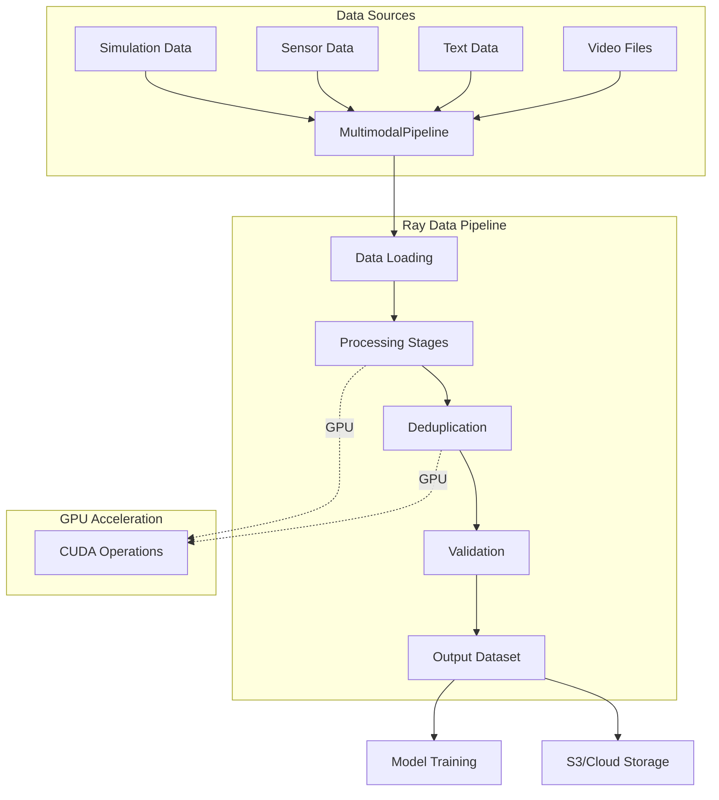
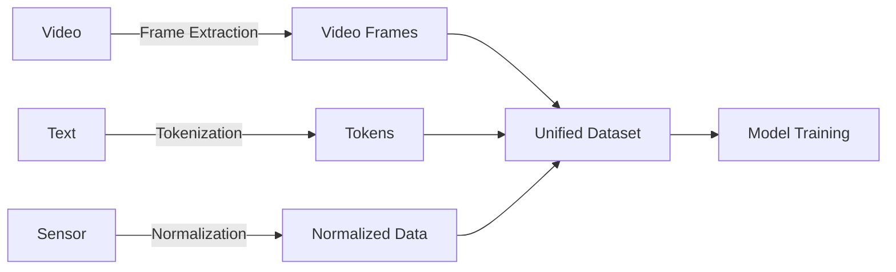

# Multimodal Data Curation Pipeline for Robotics Foundation Models

A sample GPU-accelerated data curation pipeline built on Ray for processing multimodal datasets (video, text, sensor data) used in robotics foundation model training.

## Overview

This project demonstrates large-scale distributed data ETL and management systems optimized for multimodal foundation models. It addresses the core challenges in robotics data infrastructure:

- **Scalable Processing**: Distributed data processing using Ray Data and Ray Core
- **GPU Acceleration**: CUDA-accelerated deduplication and embedding generation
- **Multimodal Support**: Unified pipeline for video, text, and sensor data
- **Streaming Architecture**: Efficient data flow with minimal I/O overhead
- **Observability**: Built-in monitoring and performance metrics
- **Production Ready**: Comprehensive testing, CI/CD, and documentation

## Architecture



## Quick Start

### Installation

```bash
# Install with development dependencies
pip install -e ".[dev]"

# Or install minimal dependencies
pip install -e .
```

### Basic Usage

#### Python API

**Declarative API (Recommended):**

```python
from pipeline.api import Pipeline

# Quick start - simplest way to create a pipeline
pipeline = Pipeline.quick_start(
    input_paths="s3://bucket/data/",
    output_path="s3://bucket/output/",
    enable_gpu=True
)

# Run pipeline
results = pipeline.run()
print(f"Processed {results['total_items']} items")
```

**Fluent Builder API:**

```python
from pipeline.api import PipelineBuilder

# Method chaining for intuitive pipeline construction
pipeline = (
    PipelineBuilder()
    .add_source("s3://bucket/videos/*.mp4")
    .add_source("s3://bucket/text/*.jsonl")
    .enable_gpu(num_gpus=4)
    .set_batch_size(32)
    .add_profiler(columns=["image", "text"])
    .add_validator(schema={"image": list, "text": str})
    .set_output("s3://bucket/output/")
    .build()
)

results = pipeline.run()
```

**DataFrame API (Pythonic):**

```python
from pipeline.api import PipelineDataFrame

# Create DataFrame from paths
df = PipelineDataFrame.from_paths(["s3://bucket/data/"])

# Use standard Python built-ins
print(f"Rows: {len(df)}")  # len() support
print(f"Shape: {df.shape}")  # (rows, columns)
print(f"Columns: {df.columns}")  # Column names

# Pythonic indexing and slicing
first_10 = df[0:10]  # Slicing (like Pandas)
column = df["episode_id"]  # Column access
value = df.episode_id  # Attribute-style access

# Operator overloading
df1 = PipelineDataFrame.from_paths(["s3://bucket/data1/"])
df2 = PipelineDataFrame.from_paths(["s3://bucket/data2/"])
combined = df1 + df2  # Concatenate (like pd.concat)

# Lazy transformations with method chaining
result = (
    df
    .filter(lambda x: x["quality"] > 0.8)
    .map(lambda x: {**x, "processed": True})
    .groupby("episode_id")
    .agg({"sensor_data": "mean"})
    .collect()  # Trigger execution
)
```

**Legacy API (Still Supported):**

```python
from pipeline import MultimodalPipeline, PipelineConfig

# Create pipeline configuration
config = PipelineConfig(
    batch_size=32,
    output_path="s3://bucket/output/",
    enable_gpu=True
)

# Initialize pipeline
pipeline = MultimodalPipeline(config)

# Add data sources
pipeline.add_video_data("s3://bucket/videos/*.mp4")
pipeline.add_text_data("s3://bucket/text/*.jsonl")

# Run pipeline
result = pipeline.run()
print(f"Processed {result['total_items']} items")
```

#### YAML Configuration

```yaml
# pipeline_config.yaml
data_sources:
  video:
    paths: ["s3://bucket/videos/*.mp4"]
    extract_frames: true
    frame_rate: 30
  
  text:
    paths: ["s3://bucket/text/*.jsonl"]
    min_length: 10
    max_length: 512

stages:
  - deduplication:
      method: "fuzzy"
      threshold: 0.9
  
  - validation:
      quality_threshold: 0.8

output:
  path: "s3://bucket/output/"
  format: "parquet"
```

```python
from pipeline.api.declarative import run_pipeline_from_yaml

# Run from YAML
result = run_pipeline_from_yaml("pipeline_config.yaml")
```

## Key Features

### 1. GPU-Accelerated Deduplication

| Method | Description | Use Case |
|--------|-------------|----------|
| **Fuzzy LSH** | Locality-sensitive hashing on GPU | Fast approximate deduplication |
| **Semantic** | Embedding-based clustering | Content similarity detection |
| **Exact** | Hash-based exact matching | Perfect duplicate removal |

```python
from pipeline.dedup import FuzzyDeduplicator

deduplicator = FuzzyDeduplicator(
    threshold=0.9,
    num_permutations=128,
    use_gpu=True
)

dataset = deduplicator.deduplicate(dataset)
```

### 2. Multimodal Data Processing



**Supported Data Types:**

- **Video**: Frame extraction, temporal segmentation, quality filtering
- **Text**: Tokenization, quality scoring, language detection
- **Sensor**: IMU data, joint angles, control signals
- **Simulation**: Isaac Lab trajectories, Cosmos Dreams outputs

### 3. Streaming Pipeline Architecture

```python
from pipeline import MultimodalPipeline
from pipeline.stages import VideoProcessor, TextProcessor

# Create pipeline with custom stages
pipeline = MultimodalPipeline(config)

# Add processing stages
pipeline.add_stage(VideoProcessor(
    extract_frames=True,
    frame_rate=30,
    resolution=(224, 224)
))

pipeline.add_stage(TextProcessor(
    min_length=10,
    remove_boilerplate=True
))

# Process with streaming execution
result = pipeline.run()
```
## New Features

### DataFrame-Like API (Inspired by Spark, Polars, Pandas)

- **PipelineDataFrame**: Fluent DataFrame API with lazy evaluation
- **Method Chaining**: Intuitive method chaining for pipeline construction
- **GPU Acceleration**: Seamless GPU acceleration for batch operations
- **Lazy Evaluation**: Transformations are lazy until actions are called
- **Comprehensive Operations**: Filter, map, groupby, join, sort, sample, and more

### Batch Inference with MLOps Integration

- **Batch Inference**: Distributed batch inference using Ray Data with GPU acceleration
- **Model Registry**: Integration with MLflow Model Registry for model versioning
- **Prediction Logging**: Automatic logging of predictions to MLflow/W&B for monitoring
- **Model Staging**: Support for model stages (Staging, Production, Archived)
- **TensorRT Support**: Optional NVIDIA TensorRT optimization for inference
- **DALI Integration**: Optional NVIDIA DALI for GPU-accelerated data loading

### Enhanced Data Quality Checks

- **Schema Validation**: Validate data schemas and detect schema drift
- **Data Profiling**: Comprehensive data profiling with statistics and outlier detection (GPU-accelerated with cuDF)
- **Drift Detection**: Detect data drift using KS test, PSI, or chi-square methods
- **Missing Value Detection**: Identify and report missing values

### Feature Engineering and ETL

- **Feature Engineering**: Extract and transform features from raw data
- **Data Transformation**: Flexible data transformation with filtering
- **Data Aggregation**: Groupby and aggregation operations (GPU-accelerated)
- **Feature Store Integration**: Integration with Feast and other feature stores

### Experiment Tracking

- **MLflow Integration**: Full MLflow experiment tracking support
- **Weights & Biases Integration**: Full W&B experiment tracking support
- **Dual Tracking**: Support for both MLflow and W&B simultaneously
- **Automatic Logging**: Automatic parameter and metric logging

## Datasource Integrations

The pipeline supports a wide range of datasources for robotics and multimodal data:

### Supported Datasources

| Datasource | Format | Description | GPU Support |
|------------|--------|-------------|-------------|
| **Video** | MP4, AVI, MOV | Frame extraction, temporal segmentation | ✅ CUDA |
| **Text** | JSONL, TXT | Tokenization, quality filtering | ✅ Embeddings |
| **Parquet** | Parquet | Structured tabular data | ✅ cuDF |
| **MCAP** | MCAP | ROS2 robotics data format | ⚠️ CPU only |
| **HDF5** | HDF5 | Scientific datasets | ⚠️ CPU only |
| **Point Cloud** | PCD, PLY | 3D point cloud data | ✅ cuPy |
| **ROS Bag** | .bag | ROS1 bag files | ⚠️ CPU only |
| **ROS2 Bag** | .db3 | ROS2 bag files | ⚠️ CPU only |
| **Velodyne** | PCAP, VLP | LIDAR sensor data | ✅ cuPy |
| **Protobuf** | .pb, .bin | Protocol buffer messages | ⚠️ CPU only |
| **MessagePack** | .msgpack | Compact binary format | ⚠️ CPU only |
| **Binary** | Custom | Raw binary with struct parsing | ⚠️ CPU only |
| **Archive** | ZIP, TAR | Compressed archives | ⚠️ CPU only |
| **YAML** | YAML | Configuration files | ⚠️ CPU only |
| **URDF/SDF** | XML | Robot description files | ⚠️ CPU only |
| **Calibration** | YAML, JSON | Camera/sensor calibration | ⚠️ CPU only |

### Using Datasources

```python
from pipeline.api import Pipeline

# Multiple datasource types
pipeline = Pipeline(
    sources=[
        # Video files
        {
            "type": "video",
            "path": "s3://bucket/videos/*.mp4",
            "extract_frames": True,
            "frame_rate": 30,
            "resolution": (224, 224)
        },
        # MCAP (ROS2) files
        {
            "type": "mcap",
            "path": "s3://bucket/ros2_bags/*.mcap",
            "topics": ["/camera/image", "/lidar/points"],
            "time_range": (0, 3600)  # First hour
        },
        # Point cloud data
        {
            "type": "pointcloud",
            "path": "s3://bucket/lidar/*.pcd",
            "max_points": 100000,
            "downsample_large": True
        },
        # HDF5 datasets
        {
            "type": "hdf5",
            "path": "s3://bucket/sensor_data/*.h5",
            "datasets": ["imu_data", "joint_angles"],
            "max_datasets": 10
        },
        # ROS1 bag files
        {
            "type": "rosbag",
            "path": "s3://bucket/ros_bags/*.bag",
            "topics": ["/camera/image_raw", "/odom"],
            "max_messages": 10000
        }
    ],
    output="s3://bucket/curated/",
    enable_gpu=True
)
```

### Custom Datasources

```python
from pipeline.datasources.base import FileBasedDatasource
from ray.data.block import Block, ArrowBlockBuilder

class CustomDatasource(FileBasedDatasource):
    def _read_stream(self, f, path: str):
        # Read and process file
        data = f.readall()
        builder = ArrowBlockBuilder()
        builder.add({"data": process_data(data)})
        yield builder.build()
```

## GPU Optimizations

The pipeline leverages NVIDIA GPU acceleration for maximum performance:

### GPU-Accelerated Features

| Feature | Technology | Speedup | Description |
|---------|------------|---------|-------------|
| **Deduplication** | CUDA LSH | 10x | Locality-sensitive hashing on GPU |
| **Embeddings** | cuPy + cuDF | 10x | GPU-accelerated embedding generation |
| **Video Processing** | CUDA + cuPy | 10x | Frame extraction and processing |
| **Array Operations** | cuPy | 5-10x | NumPy-compatible GPU arrays |
| **DataFrames** | cuDF | 5-10x | Pandas-compatible GPU DataFrames |
| **Memory Management** | RMM | - | Unified GPU memory pool |

### CUDA Optimizations

```python
from pipeline import Pipeline

# Enable GPU acceleration
pipeline = Pipeline(
    sources=[...],
    output="s3://bucket/output/",
    enable_gpu=True,
    num_gpus=4,  # Use 4 GPUs
    gpu_memory_fraction=0.8,  # Use 80% of GPU memory
    use_mixed_precision=True,  # FP16 for faster processing
    enable_cuda_graphs=True,  # CUDA graphs for performance
)
```

### GPU Memory Management

```python
from pipeline.utils.gpu.memory import (
    get_gpu_memory_info,
    check_gpu_memory,
    gpu_memory_cleanup
)

# Check GPU memory
memory_info = get_gpu_memory_info()
print(f"GPU Memory: {memory_info['used']} / {memory_info['total']} GB")

# Cleanup GPU cache
gpu_memory_cleanup()
```

### RAPIDS Integration

```python
from pipeline.utils.gpu.rapids import (
    initialize_rapids_environment,
    initialize_rmm_pool,
    optimize_cudf_settings
)

# Initialize RAPIDS for GPU-accelerated dataframes
initialize_rapids_environment()
initialize_rmm_pool(pool_size="8GB")
optimize_cudf_settings()

# Use cuDF for GPU-accelerated operations
import cudf
df = cudf.read_parquet("s3://bucket/data.parquet")
result = df.groupby("category").mean()  # Runs on GPU
```

### Performance Tuning

```python
# GPU-optimized pipeline configuration
config = PipelineConfig(
    batch_size=1024,  # Larger batches for GPU
    num_gpus=8,
    gpu_batch_size=2048,  # GPU-specific batch size
    prefetch_batches=4,  # Overlap CPU/GPU work
    use_streaming_executor=True,  # Streaming for better GPU utilization
    enable_object_spilling=False,  # Keep data on GPU
    target_max_block_size=512 * 1024 * 1024,  # 512MB blocks
)
```

### GPU Deduplication

```python
from pipeline.dedup import FuzzyDeduplicator, SemanticDeduplicator

# GPU-accelerated fuzzy deduplication
fuzzy_dedup = FuzzyDeduplicator(
    threshold=0.9,
    num_permutations=128,
    use_gpu=True,  # Enable GPU acceleration
    num_gpus=4
)

# GPU-accelerated semantic deduplication
semantic_dedup = SemanticDeduplicator(
    model_name="sentence-transformers/all-MiniLM-L6-v2",
    use_gpu=True,
    batch_size=1024  # Larger batches for GPU
)

dataset = fuzzy_dedup.deduplicate(dataset)
dataset = semantic_dedup.deduplicate(dataset)
```

## Integration Examples

### Isaac Lab Integration

```python
from pipeline.integrations.isaac_lab import IsaacLabLoader

loader = IsaacLabLoader(
    robot_type="isaac.manipulation.handover",
    include_metadata=True,
    include_observations=True,
    include_actions=True
)

pipeline.add_simulation_data(loader)
```

### Cosmos Dreams Integration

```python
from pipeline.integrations.cosmos import CosmosDreamsLoader

loader = CosmosDreamsLoader(
    dreams_path="s3://bucket/cosmos_dreams/",
    model_name="groot-dreams-v1",
    include_metadata=True
)

pipeline.add_synthetic_data(loader)
```

### GR00T Model Training

```python
from pipeline.training.integration import TrainingPipelineIntegration

# Prepare curated dataset for training
training_integration = TrainingPipelineIntegration(
    output_format="parquet",
    batch_size=256,
    shuffle=True
)

# Split into train/val and write to disk
training_data = training_integration.prepare_for_training(
    dataset=curated_dataset,
    output_path="s3://bucket/groot_training_data/",
    train_split=0.9
)

# Create PyTorch DataLoader for training
train_loader = training_integration.create_dataloader(
    dataset_path=training_data["train_path"],
    num_workers=4,
    pin_memory=True
)
```

See [`examples/groot_model_training.py`](examples/groot_model_training.py) for complete training example.

### DataFrame-Like API (Inspired by Spark, Polars, Pandas)

The `PipelineDataFrame` API provides a Pythonic, intuitive interface that supports standard Python built-ins and operators, making it familiar to users of Pandas, Spark, and Polars.

```python
from pipeline.api import PipelineDataFrame

# Create DataFrame from paths
df = PipelineDataFrame.from_paths(["s3://bucket/data/"])

# Standard Python built-ins
print(f"Number of rows: {len(df)}")  # len() support
print(f"Shape: {df.shape}")  # (rows, columns) tuple
print(f"Columns: {df.columns}")  # List of column names
print(f"Empty: {df.empty}")  # Boolean check

# Pythonic indexing and slicing (like Pandas)
column = df["episode_id"]  # Column access
first_row = df[0]  # Row indexing
first_10 = df[0:10]  # Slicing
selected = df[["col1", "col2"]]  # Multiple columns
value = df.episode_id  # Attribute-style access

# Operator overloading
df1 = PipelineDataFrame.from_paths(["s3://bucket/data1/"])
df2 = PipelineDataFrame.from_paths(["s3://bucket/data2/"])
combined = df1 + df2  # Concatenate (like pd.concat)
union = df1 | df2  # Alternative union syntax

# Lazy transformations with method chaining
result = (
    df
    .filter(lambda x: x["quality"] > 0.8)
    .map(lambda x: {**x, "processed": True})
    .groupby("episode_id")
    .agg({"sensor_data": "mean", "timestamp": "max"})
    .join(other_df, on="episode_id")
    .cache()  # Cache intermediate result
    .collect()  # Trigger execution
)

# GPU-accelerated batch processing
processed = df.map_batches(
    lambda batch: transform_batch(batch),
    batch_size=1000,
    use_gpu=True,
)

# Copy and iteration
df_copy = df.copy()  # Create copy
for row in df:  # Iterate rows
    process_row(row)
```

**Pythonic Features:**
- `len(df)` - Get number of rows (Python convention)
- `df1 + df2` - Concatenate DataFrames (like `pd.concat()`)
- `df[0:10]` - Row slicing (like Pandas)
- `df.column` - Attribute-style column access
- `df.shape`, `df.columns`, `df.empty` - Pandas-like properties
- `df.copy()` - Create a copy
- `for row in df` - Iterate over rows
- `value in df` - Check membership

See [`examples/dataframe_api_example.py`](examples/dataframe_api_example.py) for complete examples.

### Batch Inference with MLOps Integration

```python
from pipeline import MultimodalPipeline, PipelineConfig
from pipeline.stages import (
    BatchInferenceStage,
    SchemaValidator,
    DataProfiler,
    DriftDetector,
)
from pipeline.integrations import create_model_registry

# Create pipeline with MLOps integration
config = PipelineConfig(
    input_paths=["s3://bucket/inference_data/"],
    output_path="s3://bucket/predictions/",
    num_gpus=4,
)

pipeline = MultimodalPipeline(config)

# Add data quality checks
pipeline.add_stage(SchemaValidator(expected_schema={"image": list, "text": str}))
pipeline.add_stage(DataProfiler(profile_columns=["image", "sensor_data"], use_gpu=True))
pipeline.add_stage(DriftDetector(drift_threshold=0.1))

# Add batch inference with TensorRT
model_registry = create_model_registry(registry_type="mlflow")
model_uri = model_registry.get_model(model_name="groot-model", stage="Production")

pipeline.add_stage(BatchInferenceStage(
    model_uri=model_uri,
    input_column="image",
    output_column="predictions",
    use_gpu=True,
    use_tensorrt=True,
    use_dali=True,
))

results = pipeline.run()
```

See [`examples/mlops_batch_inference.py`](examples/mlops_batch_inference.py) for complete example.

## Project Structure

```
nvidia-demo/
├── pipeline/              # Main Python package
│   ├── api/              # Public API
│   ├── core/             # Core orchestration
│   ├── datasources/      # Data source implementations
│   ├── stages/           # Processing stages
│   └── training/         # Training integration
├── examples/             # Example scripts
├── docs/                 # Documentation
└── tests/                # Test suite
```

## Production Requirements

### Observability & Monitoring

The pipeline includes comprehensive observability features for production deployments:

#### Metrics & Monitoring

```python
from pipeline.observability.metrics import PipelineMetrics

# Initialize metrics collection
metrics = PipelineMetrics(
    enable_prometheus=True,
    prometheus_port=9090,
    enable_grafana=True
)

# Track custom metrics
metrics.record_stage_duration("deduplication", duration_seconds=10.5)
metrics.record_items_processed("video", count=1000)
metrics.record_gpu_utilization(gpu_id=0, utilization=0.85)
```

**Available Metrics:**

| Metric Type | Description | Export Format |
|-------------|-------------|---------------|
| **Stage Duration** | Processing time per stage | Prometheus histogram |
| **Items Processed** | Throughput per data type | Prometheus counter |
| **GPU Utilization** | GPU usage and memory | Prometheus gauge |
| **Error Rates** | Failure rates by stage | Prometheus counter |
| **Data Quality** | Quality scores and validation | Prometheus histogram |
| **Resource Usage** | CPU, memory, disk I/O | Prometheus gauge |

#### Grafana Dashboards

```python
from pipeline.visualization import generate_grafana_dashboard

# Generate Grafana dashboard configuration
dashboard_config = generate_grafana_dashboard(
    metrics_source="prometheus",
    include_gpu_metrics=True,
    include_stage_breakdown=True
)

# Export to JSON for Grafana import
with open("grafana_dashboard.json", "w") as f:
    json.dump(dashboard_config, f, indent=2)
```

**Dashboard Panels:**
- Pipeline throughput and latency
- GPU utilization and memory usage
- Stage-by-stage performance breakdown
- Error rates and failure analysis
- Data quality metrics
- Resource consumption trends

#### Health Checks

```python
from pipeline.health import HealthChecker

# Check overall system health
health = HealthChecker.get_overall_health(
    output_path="s3://bucket/output/",
    check_gpu=True,
    check_storage=True,
    check_ray_cluster=True
)

if not health['healthy']:
    print(f"Issues found: {health['issues']}")
```

**Health Check Endpoints:**
- `/health` - Basic health check
- `/health/ready` - Readiness probe (Kubernetes)
- `/health/live` - Liveness probe (Kubernetes)
- `/health/detailed` - Comprehensive health status

### Infrastructure Tooling

#### Kubernetes Operators

The pipeline integrates with standard Kubernetes operators for production infrastructure:

| Operator | Purpose | Configuration |
|----------|---------|---------------|
| **Prometheus Operator** | Metrics collection | `deployment/operators/prometheus-operator.yaml` |
| **Grafana Operator** | Dashboard management | `deployment/operators/grafana-operator.yaml` |
| **External Secrets** | Secret management | `deployment/operators/external-secrets-operator.yaml` |
| **Velero** | Backup & restore | `deployment/operators/velero-operator.yaml` |
| **VPA** | Auto-scaling | `deployment/operators/vpa-config.yaml` |
| **Fluent Bit** | Log aggregation | `deployment/operators/fluent-bit-operator.yaml` |

#### Deployment Configurations

```bash
# Deploy to Kubernetes
kubectl apply -f deployment/kubernetes-production.yaml

# Deploy with Helm
helm install pipeline ./deployment/helm

# Deploy with Kustomize
kubectl apply -k deployment/kustomize/production
```

**Production Features:**
- Horizontal Pod Autoscaling (HPA) for GPU workloads
- Vertical Pod Autoscaling (VPA) for resource optimization
- Network policies for security
- Resource quotas and limits
- Pod disruption budgets
- Service mesh integration (Istio/Linkerd)

#### CI/CD Integration

```yaml
# .github/workflows/ci.yml example
name: CI/CD Pipeline
on: [push, pull_request]
jobs:
  test:
    runs-on: [self-hosted, gpu]
    steps:
      - uses: actions/checkout@v3
      - name: Run tests
        run: pytest tests/
      - name: Run GPU tests
        run: pytest tests/ --gpu
      - name: Build Docker image
        run: docker build -t pipeline:latest .
```

### Extending the API

#### Custom Processing Stages

```python
from pipeline.stages.base import ProcessorBase
from ray.data import Dataset

class CustomProcessor(ProcessorBase):
    """Custom processing stage example."""
    
    def __init__(self, custom_param: str, batch_size: int = 100):
        super().__init__(batch_size=batch_size)
        self.custom_param = custom_param
    
    def process(self, dataset: Dataset) -> Dataset:
        """Process dataset through custom stage."""
        return dataset.map_batches(
            self._process_batch,
            batch_size=self.batch_size,
            batch_format="pandas"
        )
    
    def _process_batch(self, batch):
        # Your custom processing logic
        batch['processed'] = batch['data'].apply(self.custom_transform)
        return batch
    
    def custom_transform(self, data):
        return f"{self.custom_param}: {data}"

# Use in pipeline
pipeline = MultimodalPipeline(config)
pipeline.add_stage(CustomProcessor(custom_param="example"))
```

#### Custom Datasources

```python
from pipeline.datasources.base import FileBasedDatasource
from ray.data.block import Block, ArrowBlockBuilder
from typing import Iterator

class CustomDatasource(FileBasedDatasource):
    """Custom datasource for specialized data formats."""
    
    def _read_stream(self, f, path: str) -> Iterator[Block]:
        """Read and parse custom format."""
        self._validate_file_handle(f, path)
        
        # Read file content
        data = f.readall()
        
        # Parse custom format
        parsed_data = self._parse_custom_format(data)
        
        # Yield blocks
        builder = ArrowBlockBuilder()
        for item in parsed_data:
            builder.add({
                "field1": item["field1"],
                "field2": item["field2"],
            })
        yield builder.build()
    
    def _parse_custom_format(self, data: bytes):
        # Your parsing logic
        return [{"field1": "value1", "field2": "value2"}]

# Use in pipeline
from pipeline.api import Pipeline

pipeline = Pipeline(
    sources=[{
        "type": "custom",
        "path": "s3://bucket/custom_data/*.custom",
        "datasource_class": CustomDatasource
    }],
    output="s3://bucket/output/"
)
```

#### Custom Validators

```python
from pipeline.stages.base import ValidatorBase
from typing import Any, Dict

class CustomValidator(ValidatorBase):
    """Custom validation stage."""
    
    def __init__(self, validation_rule: str, reject_invalid: bool = False):
        super().__init__(reject_invalid=reject_invalid, batch_size=100)
        self.validation_rule = validation_rule
    
    def _validate_item(self, item: Dict[str, Any]) -> Dict[str, Any]:
        """Validate single item."""
        is_valid = self._check_rule(item)
        
        return {
            **item,
            "validation_result": "valid" if is_valid else "invalid",
            "validation_score": 1.0 if is_valid else 0.0
        }
    
    def _check_rule(self, item: Dict[str, Any]) -> bool:
        # Your validation logic
        return item.get("field") == self.validation_rule

# Use in pipeline
pipeline.add_stage(CustomValidator(validation_rule="expected_value"))
```

#### Plugin System

```python
from pipeline.core.factory import register_stage, register_datasource

# Register custom stage
@register_stage("custom_processor")
def create_custom_processor(**kwargs):
    return CustomProcessor(**kwargs)

# Register custom datasource
@register_datasource("custom_format")
def create_custom_datasource(paths, **kwargs):
    return CustomDatasource(paths=paths, **kwargs)

# Use registered components
pipeline = Pipeline(
    sources=[{"type": "custom_format", "path": "s3://bucket/data/"}],
    stages=[{"type": "custom_processor", "custom_param": "value"}]
)
```

#### API Extensions

```python
from pipeline.api.declarative import Pipeline

# Extend Pipeline class
class ExtendedPipeline(Pipeline):
    """Extended pipeline with custom methods."""
    
    def custom_method(self):
        """Custom functionality."""
        # Your custom logic
        pass
    
    def run_with_retry(self, max_retries=3):
        """Run pipeline with retry logic."""
        for attempt in range(max_retries):
            try:
                return self.run()
            except Exception as e:
                if attempt == max_retries - 1:
                    raise
                logger.warning(f"Attempt {attempt + 1} failed: {e}")

# Use extended pipeline
pipeline = ExtendedPipeline(sources=[...], output="...")
pipeline.custom_method()
result = pipeline.run_with_retry()
```

See [Architecture Extensibility Guide](docs/architecture/EXTENSIBILITY.md) for detailed extension patterns.

## Documentation

| Document | Description |
|----------|-------------|
| [Quick Start Guide](docs/guides/QUICKSTART.md) | Getting started tutorial |
| [API Reference](docs/api/README.md) | Complete API documentation |
| [Architecture](docs/architecture/OVERVIEW.md) | System architecture details |
| [Extensibility](docs/architecture/EXTENSIBILITY.md) | Extending the pipeline |
| [Deployment](docs/deployment/README.md) | Production deployment guide |
| [Production Guide](docs/deployment/PRODUCTION.md) | Production best practices |

## Requirements

- **Python**: 3.9+
- **Ray**: 2.8.0+
- **CUDA**: 11.8+ (optional, for GPU features)
- **Storage**: S3-compatible or local filesystem

## Development

```bash
# Install development dependencies
pip install -e ".[dev]"

# Run tests
pytest

# Run linting
ruff check pipeline/
mypy pipeline/

# Run examples
python examples/basic_declarative_api.py
```

## Contributing

See [CONTRIBUTING.md](CONTRIBUTING.md) for guidelines.

## License

MIT License - see [LICENSE](LICENSE) file.

## Links

- [Full Documentation](docs/README.md)
- [API Reference](docs/api/README.md)
- [Architecture Overview](docs/architecture/OVERVIEW.md)
- [Deployment Guide](docs/deployment/README.md)
