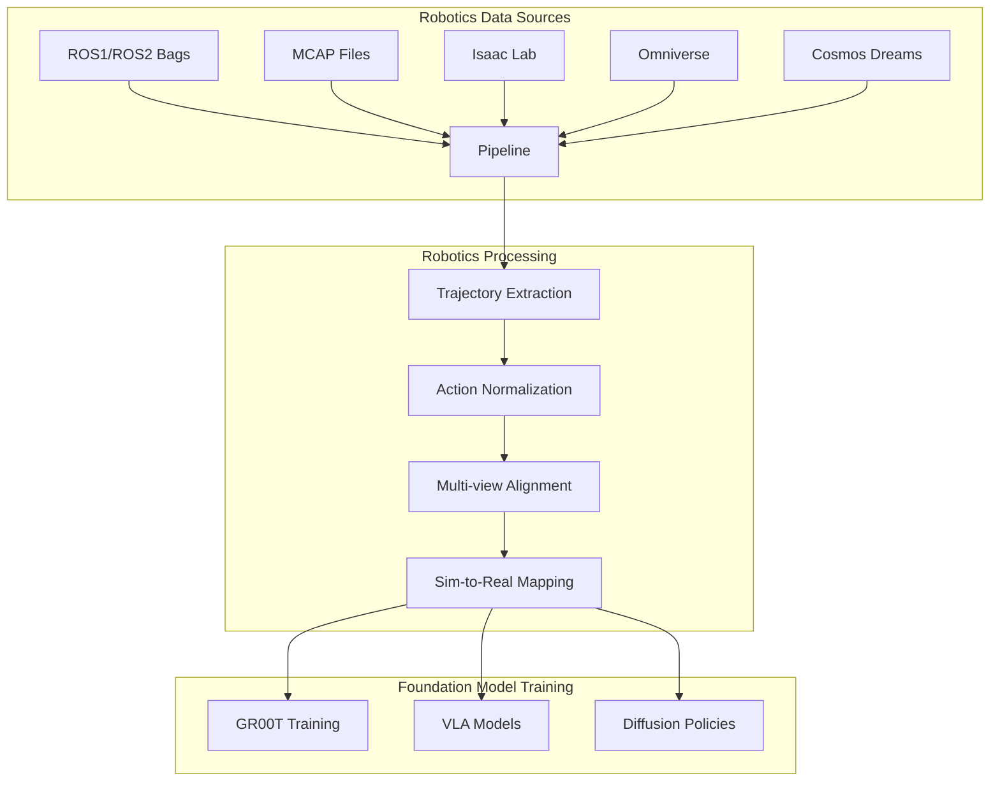
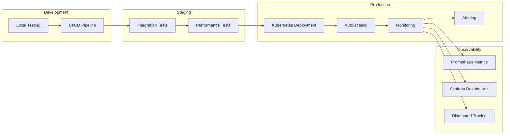

# Business Value

## Why This Pipeline?

### Higher-Level API Than Ray Data

While Ray Data provides powerful distributed processing primitives, this pipeline adds a **robotics-focused abstraction layer** that simplifies common workflows:

```python
# Ray Data (lower-level)
dataset = ray.data.read_parquet("s3://bucket/data/")
dataset = dataset.map_batches(process_fn, batch_size=100)
dataset = dataset.filter(lambda x: x["quality"] > 0.8)
dataset.write_parquet("s3://bucket/output/")

# This Pipeline (higher-level, robotics-focused)
p = pipeline(
    sources="s3://bucket/data/",
    output="s3://bucket/output/",
    num_gpus=4
)
results = p.run()  # Automatic deduplication, validation, quality checks
```

**Benefits:**
- **Domain-Specific**: Built-in support for robotics data formats (MCAP, ROS bags, URDF)
- **MLOps Integration**: Automatic experiment tracking, model registry, and data lineage
- **Quality Assurance**: Built-in profiling, validation, and drift detection
- **GPU Optimization**: Automatic GPU memory management and CUDA acceleration

### Robotics-Specific Features

Designed specifically for robotics foundation model training with native support for:



- **Native ROS Support**: Direct integration with ROS1/ROS2 bag files and MCAP format
- **Simulation Integration**: Seamless data loading from Isaac Lab and Omniverse
- **Trajectory Processing**: Built-in support for robot trajectories, actions, and observations
- **Multi-modal Alignment**: Automatic synchronization of video, sensor, and control data
- **Sim-to-Real**: Tools for bridging simulation and real-world robotics data
- **Domain Randomization**: Automatic parameter randomization for robust sim-to-real transfer
- **Teleoperation Processing**: VR-based teleoperation data processing with multi-view synchronization
- **High-Throughput Simulation**: Support for 10,000+ parallel environments with GPU acceleration
- **Data Hierarchy**: Explicit support for internet-scale data, synthetic simulation data, and teleoperation data

### GR00T Data Hierarchy

Explicit support for NVIDIA's data pyramid strategy:

```python
# Internet-scale data: Web data and human videos
internet_scale_sources = [
    "s3://bucket/internet_videos/",  # 100M+ video clips
    "s3://bucket/text_corpus/",      # Web-scale text data
]

# Synthetic data: Simulation data from Simulation 1.0 and 2.0
synthetic_sources = [
    isaac_lab_loader,  # Simulation 1.0: Digital twins
    cosmos_dreams_loader,  # Simulation 2.0: Neurophysics engines
]

# Teleoperation data: Real robot teleoperation data
teleoperation_sources = [
    "s3://bucket/teleop_data/",  # 4-24 hours per robot per day
]
```

**Features:**
- **Internet-Scale Data Processing**: Internet-scale data deduplication and quality filtering
- **Synthetic Data Generation**: High-throughput synthetic data generation (10,000x faster than real-time)
- **Teleoperation Data Collection**: Teleoperation data processing with VR support and multi-view synchronization
- **Unified Pipeline**: Seamlessly combines all three data types into training-ready datasets

### Repeatability & Reproducibility

Ensure consistent, reproducible data processing across teams and environments:

```yaml
# pipeline_config.yaml - Version controlled, reproducible
sources:
  - type: video
    path: s3://bucket/videos/
output: s3://bucket/curated/
num_gpus: 4
batch_size: 1024
```

**Features:**
- **Declarative Configuration**: YAML-based pipelines that are version-controlled and shareable
- **Deterministic Processing**: Reproducible results with seed support and deterministic algorithms
- **Experiment Tracking**: Full lineage tracking with MLflow/W&B integration
- **Checkpointing**: Resume from failures with automatic checkpoint management
- **Environment Isolation**: Docker and Kubernetes support for consistent execution

### Extensibility & Customization

Easily extend the pipeline with custom stages, datasources, and integrations:

```python
# Custom processing stage
class CustomRoboticsStage(PipelineStage):
    def process(self, dataset):
        return dataset.map_batches(self._process_robotics_batch)
    
    def _process_robotics_batch(self, batch):
        # Your custom robotics processing logic
        return transform_robotics_data(batch)

# Use in pipeline
p = (
    PipelineBuilder()
    .source("mcap", "s3://bucket/rosbags/")
    .stage(CustomRoboticsStage())
    .output("s3://bucket/output/")
    .build()
)
```

**Extensibility Points:**
- **Custom Stages**: Add any processing logic as a pipeline stage
- **Custom Datasources**: Support for any data format with plugin system
- **Custom Validators**: Domain-specific validation rules
- **Custom Metrics**: Add custom observability metrics
- **Plugin Architecture**: Modular design for easy extension

### Production-Ready Operations

Built for production deployments with enterprise-grade features:



- **Kubernetes Native**: Full support for K8s deployment with Helm charts
- **Auto-scaling**: Automatic resource scaling based on workload
- **Monitoring**: Prometheus metrics, Grafana dashboards, distributed tracing
- **Error Handling**: Robust error handling with retry mechanisms and graceful degradation
- **Security**: Support for secrets management, network policies, and RBAC

### Cost Efficiency

Optimize compute costs with intelligent resource management:

- **GPU Utilization**: Maximize GPU usage with automatic batch sizing and memory management
- **Streaming Execution**: Process data incrementally to reduce memory footprint
- **Smart Caching**: Intelligent caching to avoid redundant computation
- **Resource Tuning**: Automatic per-stage resource allocation based on historical metrics
- **Spot Instance Support**: Designed to work with spot instances for cost savings

