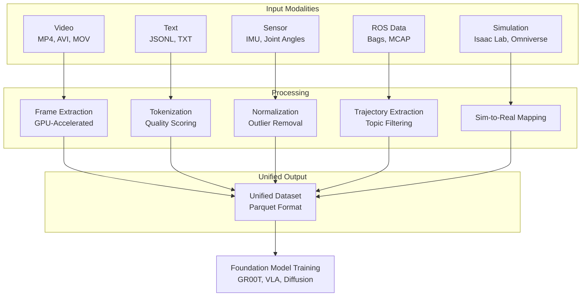
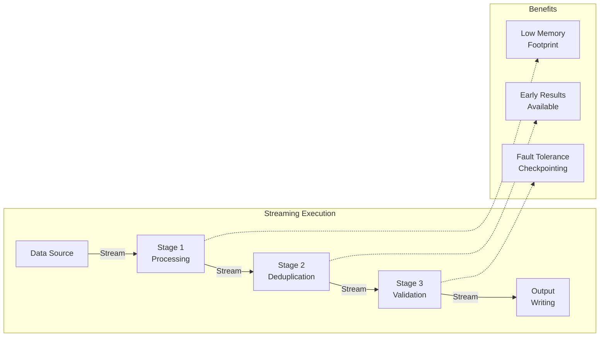
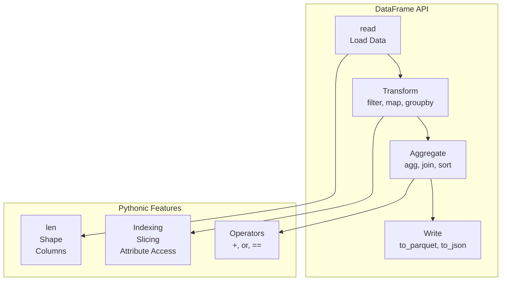

# Key Features

## GPU-Accelerated Deduplication

| Method | Description | Use Case |
|--------|-------------|----------|
| **Fuzzy LSH** | Locality-sensitive hashing on GPU | Fast approximate deduplication |
| **Semantic** | Embedding-based clustering | Content similarity detection |
| **Exact** | Hash-based exact matching | Perfect duplicate removal |

```python
from pipeline.dedup import FuzzyDeduplicator

deduplicator = FuzzyDeduplicator(
    threshold=0.9,
    num_permutations=128,
    use_gpu=True
)

dataset = deduplicator.deduplicate(dataset)
```

## Multimodal Data Processing



**Supported Data Types:**
- **Video**: Frame extraction, temporal segmentation, quality filtering
- **Text**: Tokenization, quality scoring, language detection
- **Sensor**: IMU data, joint angles, control signals
- **Simulation**: Isaac Lab trajectories (10,000+ parallel environments), Cosmos Dreams outputs
- **Teleoperation**: VR-based teleoperation data with multi-view camera synchronization
- **Domain Randomization**: Automatic parameter randomization for sim-to-real transfer

## Streaming Pipeline Architecture



**Key Advantages:**
- **Low Memory Footprint**: Process data incrementally without loading entire dataset
- **Early Results**: Start consuming output while pipeline is still running
- **Fault Tolerance**: Automatic checkpointing enables resume from failures
- **Scalability**: Handle datasets larger than available memory
- **Trillions of Tokens**: Designed to process internet-scale datasets (100M+ video clips, billions of tokens)
- **High-Throughput Simulation**: Support for 10,000+ parallel Isaac Lab environments (10,000x faster than real-time)

```python
from pipeline import MultimodalPipeline
from pipeline.stages import VideoProcessor, TextProcessor

# Create pipeline with custom stages
pipeline = MultimodalPipeline(config)

# Add processing stages
pipeline.add_stage(VideoProcessor(
    extract_frames=True,
    frame_rate=30,
    resolution=(224, 224)
))

pipeline.add_stage(TextProcessor(
    min_length=10,
    remove_boilerplate=True
))

# Process with streaming execution
result = pipeline.run()
```

## DataFrame-Like API (Inspired by Spark, Polars, Pandas)



**Benefits:**
- **PipelineDataFrame**: Fluent DataFrame API with lazy evaluation
- **Method Chaining**: Intuitive method chaining for pipeline construction
- **GPU Acceleration**: Seamless GPU acceleration for batch operations
- **Lazy Evaluation**: Transformations are lazy until actions are called
- **Comprehensive Operations**: Filter, map, groupby, join, sort, sample, and more

## Batch Inference with MLOps Integration

- **Batch Inference**: Distributed batch inference using Ray Data with GPU acceleration
- **Model Registry**: Integration with MLflow Model Registry for model versioning
- **Prediction Logging**: Automatic logging of predictions to MLflow/W&B for monitoring
- **Model Staging**: Support for model stages (Staging, Production, Archived)
- **TensorRT Support**: Optional NVIDIA TensorRT optimization for inference
- **DALI Integration**: Optional NVIDIA DALI for GPU-accelerated data loading

## Enhanced Data Quality Checks

- **Schema Validation**: Validate data schemas and detect schema drift
- **Data Profiling**: Comprehensive data profiling with statistics and outlier detection (GPU-accelerated with cuDF)
- **Drift Detection**: Detect data drift using KS test, PSI, or chi-square methods
- **Missing Value Detection**: Identify and report missing values

## Feature Engineering and ETL

- **Feature Engineering**: Extract and transform features from raw data
- **Data Transformation**: Flexible data transformation with filtering
- **Data Aggregation**: Groupby and aggregation operations (GPU-accelerated)
- **Feature Store Integration**: Integration with Feast and other feature stores

## Experiment Tracking

- **MLflow Integration**: Full MLflow experiment tracking support
- **Weights & Biases Integration**: Full W&B experiment tracking support
- **Dual Tracking**: Support for both MLflow and W&B simultaneously
- **Automatic Logging**: Automatic parameter and metric logging

## GR00T-Specific Features

**Domain Randomization:**
- Visual randomization (lighting, textures, backgrounds)
- Physical randomization (friction, mass, damping, gravity)
- Geometric randomization (object sizes, positions, orientations)
- Sensor randomization (camera noise, calibration errors)
- Dynamics randomization (actuator delays, joint limits, compliance)
- Supports 10,000+ randomized environments for robust sim-to-real transfer

**Teleoperation Processing:**
- VR-based teleoperation support (Apple Vision Pro, etc.)
- Multi-view camera synchronization (2-4 camera views)
- Real-time data streaming at 10-30 Hz control frequency
- Action retargeting (human to robot kinematics)
- Temporal alignment and trajectory segmentation
- Handles 4-24 hours of teleoperation data per robot per day

**High-Throughput Simulation:**
- Parallel environment support (10,000+ environments on GPU)
- GPU-accelerated PhysX physics simulation
- 10,000x faster than real-time simulation speed
- Efficient vectorized operations for massive parallel execution

