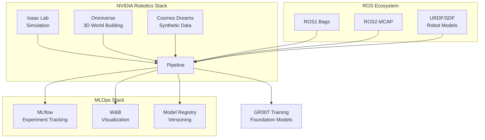

# Integration Examples

## Robotics Ecosystem Integration



## Isaac Lab Integration

```python
from pipeline.integrations.isaac_lab import IsaacLabLoader

loader = IsaacLabLoader(
    robot_type="isaac.manipulation.handover",
    include_metadata=True,
    include_observations=True,
    include_actions=True,
    enable_domain_randomization=True,
    num_parallel_environments=4096,
    use_gpu=True,
)

pipeline.add_simulation_data(loader)
```

**High-Throughput Simulation:**
- Supports 10,000+ parallel environments on GPU
- GPU-accelerated PhysX physics simulation
- 10,000x faster than real-time simulation speed
- Domain randomization for robust sim-to-real transfer

## Cosmos Dreams Integration

```python
from pipeline.integrations.cosmos import CosmosDreamsLoader

loader = CosmosDreamsLoader(
    dreams_path="s3://bucket/cosmos_dreams/",
    model_name="groot-dreams-v1",
    include_metadata=True
)

pipeline.add_synthetic_data(loader)
```

## GR00T Model Training

```python
from pipeline.training.integration import TrainingPipelineIntegration
from pipeline.utils.domain_randomization import DomainRandomizer
from pipeline.utils.teleoperation import TeleoperationProcessor

# Prepare curated dataset for training
training_integration = TrainingPipelineIntegration(
    output_format="parquet",
    batch_size=256,
    shuffle=True
)

# Split into train/val and write to disk
training_data = training_integration.prepare_for_training(
    dataset=curated_dataset,
    output_path="s3://bucket/groot_training_data/",
    train_split=0.9
)

# Create PyTorch DataLoader for training
train_loader = training_integration.create_dataloader(
    dataset_path=training_data["train_path"],
    num_workers=4,
    pin_memory=True
)
```

**GR00T-Specific Training Features:**
- **Data Hierarchy**: Explicit support for internet-scale data, synthetic simulation data, and teleoperation data
- **Domain Randomization**: Automatic parameter randomization for sim-to-real transfer
- **Teleoperation Processing**: VR-based teleoperation data with multi-view synchronization
- **High-Throughput Simulation**: 10,000+ parallel environments (10,000x faster than real-time)
- **Trillions of Tokens**: Designed to process internet-scale datasets efficiently

See [`examples/groot_model_training.py`](../../examples/groot_model_training.py) for complete training example.

See [`examples/mlops_batch_inference.py`](../../examples/mlops_batch_inference.py) for complete batch inference example.

