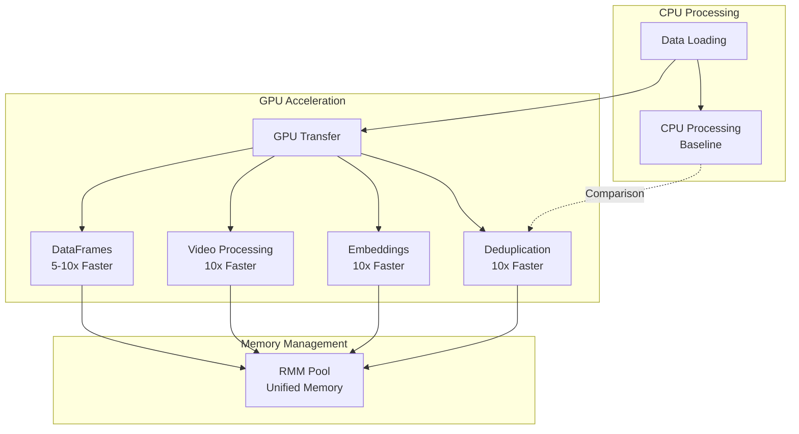

# GPU Optimizations

The pipeline leverages NVIDIA GPU acceleration for maximum performance:



## GPU-Accelerated Features

| Feature | Technology | Speedup | Description |
|---------|------------|---------|-------------|
| **Deduplication** | CUDA LSH | 10x | Locality-sensitive hashing on GPU |
| **Embeddings** | cuPy + cuDF | 10x | GPU-accelerated embedding generation |
| **Video Processing** | CUDA + cuPy | 10x | Frame extraction and processing |
| **Array Operations** | cuPy | 5-10x | NumPy-compatible GPU arrays |
| **DataFrames** | cuDF | 5-10x | Pandas-compatible GPU DataFrames |
| **Memory Management** | RMM | - | Unified GPU memory pool |

## CUDA Optimizations

```python
from pipeline import Pipeline

# Enable GPU acceleration
pipeline = Pipeline(
    sources=[...],
    output="s3://bucket/output/",
    enable_gpu=True,
    num_gpus=4,  # Use 4 GPUs
    gpu_memory_fraction=0.8,  # Use 80% of GPU memory
    use_mixed_precision=True,  # FP16 for faster processing
    enable_cuda_graphs=True,  # CUDA graphs for performance
)
```

## GPU Memory Management

```python
from pipeline.utils.gpu.memory import (
    get_gpu_memory_info,
    check_gpu_memory,
    gpu_memory_cleanup
)

# Check GPU memory
memory_info = get_gpu_memory_info()
print(f"GPU Memory: {memory_info['used']} / {memory_info['total']} GB")

# Cleanup GPU cache
gpu_memory_cleanup()
```

## RAPIDS Integration

```python
from pipeline.utils.gpu.rapids import (
    initialize_rapids_environment,
    initialize_rmm_pool,
    optimize_cudf_settings
)

# Initialize RAPIDS for GPU-accelerated dataframes
initialize_rapids_environment()
initialize_rmm_pool(pool_size="8GB")
optimize_cudf_settings()

# Use cuDF for GPU-accelerated operations
import cudf
df = cudf.read_parquet("s3://bucket/data.parquet")
result = df.groupby("category").mean()  # Runs on GPU
```

## Performance Tuning

```python
# GPU-optimized pipeline configuration for GR00T-scale workloads
config = PipelineConfig(
    batch_size=1024,  # Larger batches for GPU
    num_gpus=256,  # Scale to internet-scale datasets
    gpu_batch_size=2048,  # GPU-specific batch size
    prefetch_batches=4,  # Overlap CPU/GPU work
    streaming=True,  # Streaming for better GPU utilization
    enable_object_spilling=False,  # Keep data on GPU
    target_max_block_size=512 * 1024 * 1024,  # 512MB blocks
    enable_domain_randomization=True,  # For sim-to-real transfer
    num_randomized_environments=10000,  # High-throughput simulation
)
```

**Performance Characteristics:**
- **Simulation Speedup**: 10,000x faster than real-time with GPU acceleration
- **Parallel Environments**: 10,000+ environments per GPU
- **Throughput**: 10,000+ environment steps per second on single GPU
- **Scalability**: Linear scaling with GPU count
- **Memory Efficiency**: Shared GPU memory for common assets, efficient state caching

## GPU Deduplication

```python
from pipeline.dedup import FuzzyDeduplicator, SemanticDeduplicator

# GPU-accelerated fuzzy deduplication
fuzzy_dedup = FuzzyDeduplicator(
    threshold=0.9,
    num_permutations=128,
    use_gpu=True,  # Enable GPU acceleration
    num_gpus=4
)

# GPU-accelerated semantic deduplication
semantic_dedup = SemanticDeduplicator(
    model_name="sentence-transformers/all-MiniLM-L6-v2",
    use_gpu=True,
    batch_size=1024  # Larger batches for GPU
)

dataset = fuzzy_dedup.deduplicate(dataset)
dataset = semantic_dedup.deduplicate(dataset)
```

